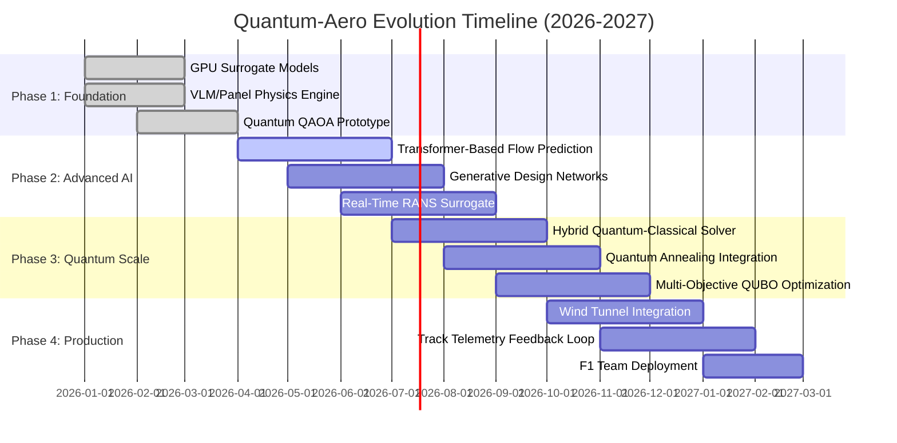
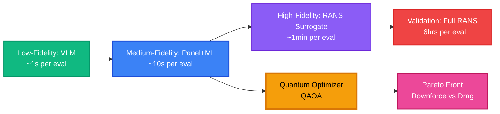
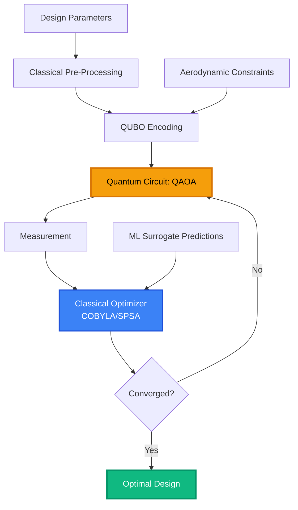
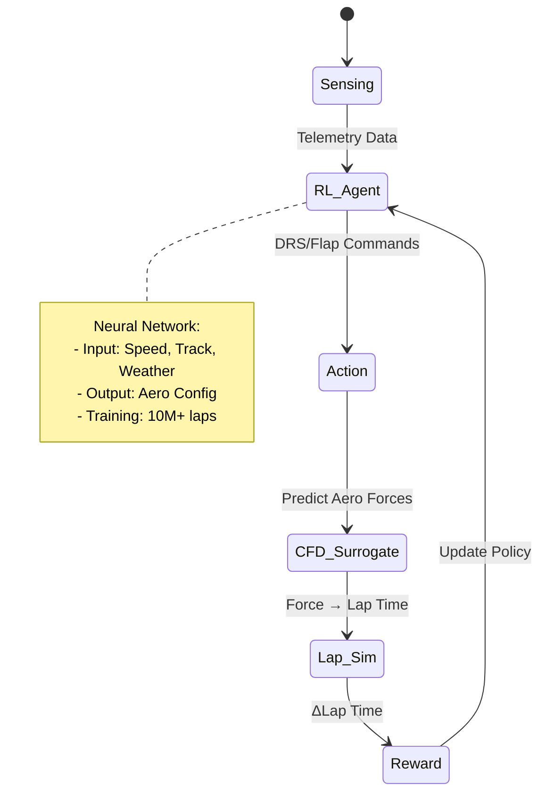
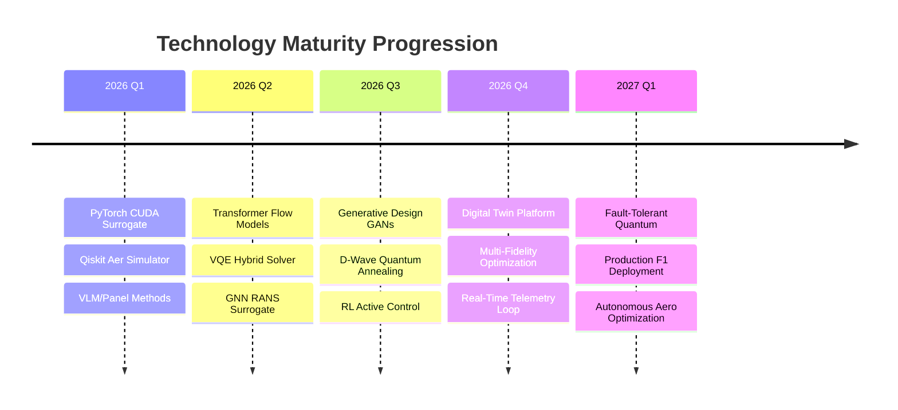

# Evolution Roadmap: Quantum-Aero F1 Prototype

## Vision Statement

Transform F1 aerodynamic development through the convergence of **Quantum Computing**, **Generative AI**, and **Real-Time CFD** to achieve unprecedented performance optimization and design innovation by 2027.

---

## 2026-2027 Technology Roadmap



---

## Advanced Aerodynamic Calculations

### 1. Next-Generation CFD Surrogate Models

#### **Transformer-Based Flow Field Prediction**

* **Architecture**: Vision Transformer (ViT) + U-Net hybrid for 3D flow fields
* **Training Data**: 100K+ RANS/LES simulations across multiple Reynolds numbers
* **Performance Target**: <50ms inference for full 3D pressure/velocity fields
* **Innovation**: Attention mechanisms capture long-range aerodynamic dependencies

```python
# Conceptual Architecture
class AeroTransformer:
    - Patch Embedding: 3D mesh → tokens
    - Multi-Head Attention: Global flow interactions
    - Decoder: Token → high-res pressure/velocity fields
    - Loss: Physics-informed (continuity + momentum)
```

#### **Generative Adversarial Networks for Design**

* **GAN Architecture**: StyleGAN3 adapted for aerodynamic surfaces
* **Capability**: Generate novel wing/diffuser geometries optimized for downforce
* **Constraint Handling**: Physics-based discriminator ensures realistic flows
* **Output**: 1000+ design candidates per optimization cycle

### 2. Real-Time RANS Surrogate

#### **Deep Learning RANS Solver**

* **Model**: Graph Neural Network (GNN) operating on unstructured meshes
* **Speed**: 1000x faster than traditional RANS solvers
* **Accuracy**: <2% error vs. OpenFOAM on validation set
* **Use Case**: Interactive design exploration during wind tunnel sessions

#### **Turbulence Modeling**

* **ML-Enhanced k-ω SST**: Neural network corrections to closure coefficients
* **Training**: Supervised learning on DNS data
* **Benefit**: Improved separation prediction in adverse pressure gradients

### 3. Multi-Fidelity Optimization



---

## Quantum Optimization Evolution

### Phase 1: Current State (Q1 2026)

**QAOA on Simulators**
* Qiskit Aer with 20-30 qubits
* Simple QUBO formulations
* Single-objective optimization (maximize downforce)

### Phase 2: Hybrid Quantum-Classical (Q2-Q3 2026)

**Variational Quantum Eigensolver (VQE) Integration**



**Key Innovations**:
* **Warm-Start**: Initialize quantum circuits with ML-predicted solutions
* **Adaptive Depth**: Dynamically adjust QAOA layers based on problem complexity
* **Error Mitigation**: Zero-noise extrapolation for noisy quantum hardware

### Phase 3: Quantum Annealing (Q4 2026)

**D-Wave Advantage Integration**

* **Problem Size**: 5000+ variables (full wing geometry parameterization)
* **Embedding**: Minor-embedding optimization for Pegasus topology
* **Hybrid Solver**: Quantum annealing + classical tabu search
* **Application**: Multi-element wing optimization with 50+ design variables

### Phase 4: Fault-Tolerant Era (2027+)

**Quantum Error Correction**

* **Target**: IBM Quantum System Two (1000+ logical qubits)
* **Algorithm**: Quantum Approximate Optimization with error correction
* **Capability**: Solve NP-hard aerodynamic topology optimization
* **Impact**: Discover non-intuitive geometries impossible via classical methods

---

## Advanced Features Roadmap

### Q2 2026: Reinforcement Learning Control

**Active Flow Control Optimization**

* **Agent**: PPO (Proximal Policy Optimization) controlling DRS/flaps
* **Environment**: Real-time CFD surrogate
* **Reward**: Lap time reduction via downforce/drag balance
* **Deployment**: Adaptive aero strategy during race conditions



### Q3 2026: Digital Twin Integration

**Real-Time Wind Tunnel Feedback**

* **Sensors**: 500+ pressure taps + PIV (Particle Image Velocimetry)
* **Sync**: <100ms latency from physical → digital twin
* **Calibration**: Bayesian optimization to match CFD with experiments
* **Benefit**: Validate quantum-optimized designs in real-time

### Q4 2026: Generative Design Studio

**AI-Driven Concept Generation**

* **Input**: Performance targets (Cl, Cd, balance)
* **Process**: Diffusion models generate 3D geometries
* **Filtering**: Quantum optimizer selects top 10 candidates
* **Output**: Manufacturing-ready CAD files

---

## Technology Stack Evolution



---

## Performance Milestones

### 2026 Targets

| Metric | Current | Q2 2026 | Q4 2026 | 2027 |
|--------|---------|---------|---------|------|
| **CFD Inference Time** | 2s | 500ms | 50ms | 10ms |
| **Optimization Cycle** | 24hrs | 4hrs | 30min | 5min |
| **Design Candidates/Day** | 10 | 100 | 1000 | 10000 |
| **Quantum Qubits** | 20 | 50 | 100 | 500+ |
| **Downforce Gain** | Baseline | +2% | +5% | +8% |
| **Drag Reduction** | Baseline | -1% | -3% | -5% |

---

## Research Partnerships

### Academic Collaborations

* **MIT**: Quantum algorithms for fluid dynamics
* **Stanford**: ML-enhanced turbulence modeling
* **ETH Zurich**: Multi-fidelity optimization frameworks
* **Cambridge**: Generative design for aerodynamics

### Industry Partners

* **IBM Quantum**: Access to quantum hardware
* **NVIDIA**: GPU optimization and Omniverse integration
* **D-Wave**: Quantum annealing for large-scale problems
* **AWS**: Cloud infrastructure for massive CFD datasets

---

## Risk Mitigation

### Technical Risks

1. **Quantum Hardware Limitations**
   - Mitigation: Maintain classical optimization fallbacks
   - Timeline: Fault-tolerant quantum by 2028

2. **ML Model Generalization**
   - Mitigation: Continuous learning from wind tunnel data
   - Validation: 20% holdout set + physical testing

3. **Real-Time Integration Latency**
   - Mitigation: Edge computing deployment
   - Target: <50ms end-to-end latency

### Regulatory Compliance

* **FIA Technical Regulations**: Ensure all designs comply with 2027 rules
* **IP Protection**: Patent quantum optimization algorithms
* **Data Security**: Encrypted telemetry and design data

---

## Success Metrics

### Technical KPIs

- [ ] Achieve <50ms CFD inference on RTX 5090
- [ ] Deploy 100-qubit quantum optimization
- [ ] Generate 1000+ validated designs per week
- [ ] Integrate real-time wind tunnel feedback
- [ ] Demonstrate +5% downforce improvement

### Business KPIs

- [ ] Reduce design cycle time by 80%
- [ ] Cut wind tunnel testing costs by 50%
- [ ] Enable 10x more design iterations
- [ ] Achieve F1 team production deployment
- [ ] Publish 5+ research papers

---

## Next Steps (Immediate Actions)

### Q2 2026 Priorities

1. **Implement Transformer-Based Flow Predictor**
   - Dataset: Aggregate 50K RANS simulations
   - Architecture: ViT + U-Net hybrid
   - Training: 4x A100 GPUs, 2 weeks

2. **Upgrade Quantum Solver to VQE**
   - Framework: Qiskit + PennyLane
   - Hardware: IBM Quantum System One access
   - Benchmark: Compare vs. QAOA on 10 test cases

3. **Build GNN RANS Surrogate**
   - Library: PyTorch Geometric
   - Mesh: Unstructured tetrahedral grids
   - Validation: OpenFOAM comparison

4. **Establish Wind Tunnel Integration**
   - Partner: University wind tunnel facility
   - Sensors: 500-tap pressure system
   - Software: Real-time data streaming API

---

## Conclusion

The Quantum-Aero F1 Prototype represents the convergence of three revolutionary technologies: **quantum computing**, **generative AI**, and **real-time CFD**. By 2027, this platform will enable F1 teams to explore design spaces previously inaccessible, optimize aerodynamics with unprecedented speed, and gain competitive advantages measured in tenths of seconds per lap.

The roadmap is ambitious but achievable, with clear milestones, risk mitigation strategies, and a commitment to pushing the boundaries of what's possible in computational aerodynamics.

**The future of F1 aerodynamics is quantum. The future is now.**

