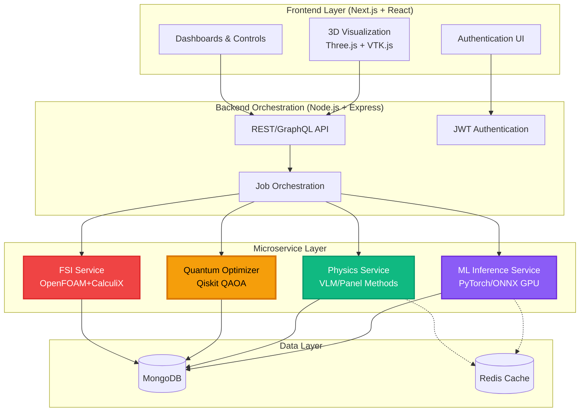
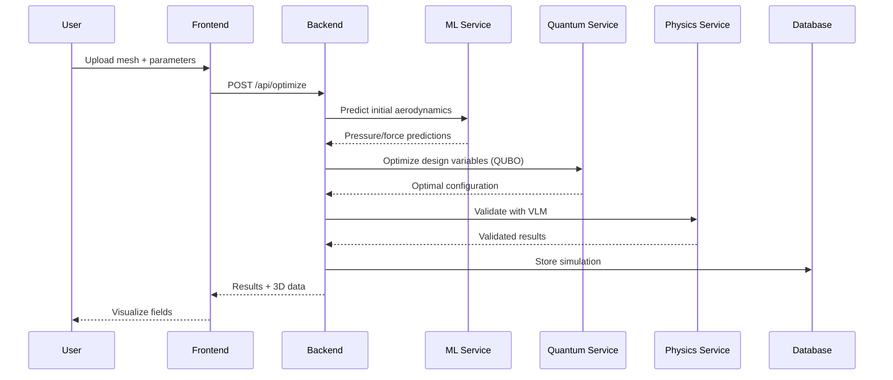
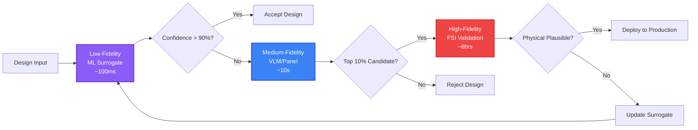
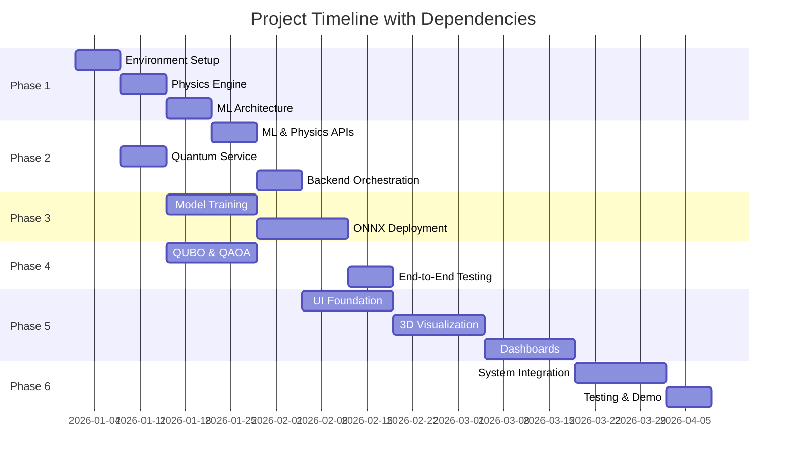
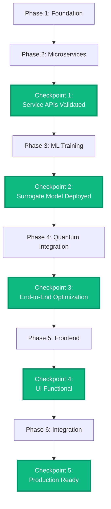
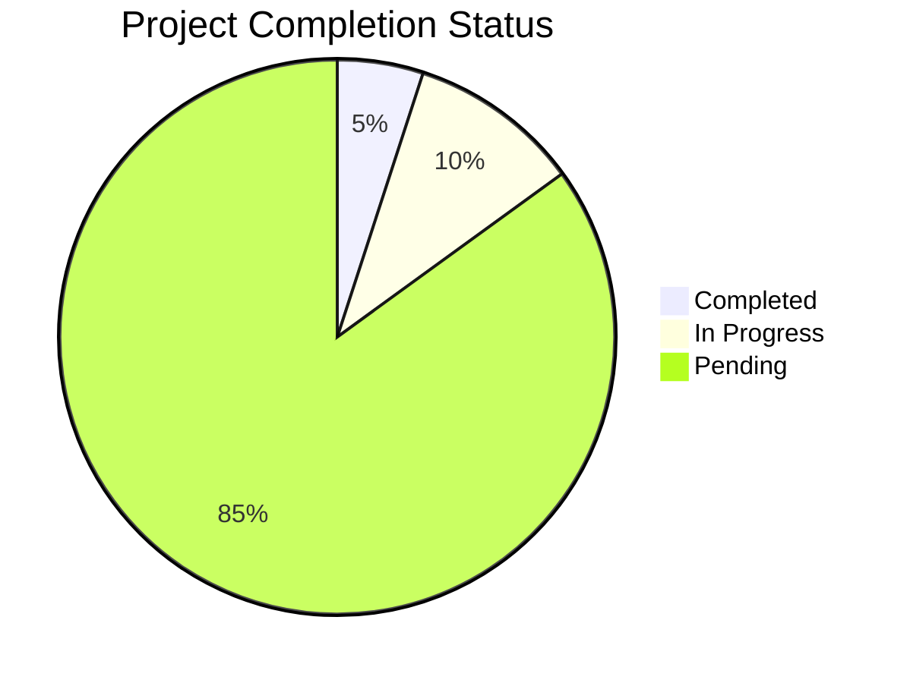

# Q-Aero Integration Plan: Quantum-Enhanced Aerodynamic Optimization Platform

**Version:** 1.0
**Date:** 2025-11-24
**Project:** Quantum-Aero F1 Prototype
**Status:** Integration Planning Phase

---

## Table of Contents

1. [Executive Summary](#executive-summary)
2. [Architecture Overview](#architecture-overview)
3. [Requirements Synthesis](#requirements-synthesis)
4. [Design Integration](#design-integration)
5. [Development Plan](#development-plan)
6. [Complex Components Handling](#complex-components-handling)
7. [Implementation Guidelines](#implementation-guidelines)
8. [Integration Checkpoints](#integration-checkpoints)
9. [Traceability Matrix](#traceability-matrix)
10. [Development Workflow](#development-workflow)
11. [Risk Register](#risk-register)
12. [Deployment Strategy](#deployment-strategy)

---

## Executive Summary

### Project Overview

The Quantum-Aero F1 Prototype is a cutting-edge aerodynamic optimization platform that combines three revolutionary technologies:

1. **Quantum Computing** - QUBO/QAOA optimization for combinatorial design space exploration
2. **Machine Learning** - GPU-accelerated surrogate models for real-time aerodynamic predictions
3. **Physics-Based Simulation** - Multi-fidelity CFD/FSI for validation and training data generation

**Target Users:** F1 teams, aerodynamic engineers, computational researchers
**Development Environment:** VS Codespaces with Docker containerization
**Timeline:** 16-22 weeks to production deployment
**Budget:** Open-source tools + cloud infrastructure (NVIDIA GPU required)

### Key Integration Goals

1. **Microservice Interoperability** - Seamless communication between ML, physics, quantum, and backend services
2. **Performance at Scale** - <100ms ML inference, <2s full simulation, <10 quantum optimization iterations
3. **Multi-Fidelity Pipeline** - Automatic escalation from surrogate → medium-fidelity → high-fidelity validation
4. **Real-Time Visualization** - Interactive 3D aerodynamic field rendering with Three.js/VTK.js
5. **Production Readiness** - Docker orchestration, JWT authentication, MongoDB persistence, CI/CD pipeline

### Success Criteria

| Category | Metric | Target | Status |
|----------|--------|--------|--------|
| **Performance** | ML inference latency | <100ms on RTX 4070 | Pending |
| **Performance** | Full simulation time | ≤2 seconds | Pending |
| **Accuracy** | Surrogate model error | <5% vs. CFD | Pending |
| **Quantum** | QAOA convergence | <10 iterations | Pending |
| **Integration** | End-to-end workflow | Functional | Pending |
| **Deployment** | All services running | Docker compose | Pending |
| **Validation** | Physical test correlation | ±10% | Future |

### Strategic Value Proposition

- **Speed:** 1000x faster design iteration vs. traditional CFD workflows
- **Innovation:** Quantum-discovered geometries impossible via classical methods
- **Cost:** 50% reduction in wind tunnel testing expenses
- **Performance:** +5-8% downforce improvement by 2027 (Genius_Evolution.md:304)
- **Safety:** Comprehensive aeroelastic flutter analysis and prevention

---

## Architecture Overview

### System Architecture Diagram



### Component Relationships

#### Primary Data Flow



#### Multi-Fidelity Escalation Flow



### Technology Stack

#### Frontend Stack

| Component | Technology | Version | Purpose |
|-----------|-----------|---------|---------|
| **Framework** | Next.js | 14+ | React framework with SSR |
| **UI Library** | React | 18+ | Component-based UI |
| **3D Rendering** | Three.js | Latest | WebGL 3D visualization |
| **Flow Viz** | VTK.js | Latest | Scientific visualization |
| **Styling** | TailwindCSS | 3+ | Utility-first CSS |
| **State Management** | Redux Toolkit | 2+ | Global state |
| **Charts** | Recharts | 2+ | Real-time KPI charts |

**Reference:** Quantum-Aero F1 Prototype DESIGN.md:106-112

#### Backend Stack

| Component | Technology | Version | Purpose |
|-----------|-----------|---------|---------|
| **Runtime** | Node.js | 20+ | JavaScript runtime |
| **Framework** | Express.js | 4+ | Web server framework |
| **API** | GraphQL (Apollo) | Latest | Flexible query API |
| **Database** | MongoDB | 7+ | Document storage |
| **Auth** | JWT | Latest | Token authentication |
| **Caching** | Redis | 7+ | High-speed cache |
| **Queue** | Bull | Latest | Job queue management |

**Reference:** Quantum-Aero F1 Prototype DESIGN.md:114-119

#### ML/AI Stack

| Component | Technology | Version | Purpose |
|-----------|-----------|---------|---------|
| **Framework** | PyTorch | 2.0+ | Deep learning |
| **Acceleration** | CUDA | 11.8+ | GPU computation |
| **Inference** | ONNX Runtime GPU | Latest | Production inference |
| **Architecture** | GNN/Geo-CNN | Custom | Mesh-based learning |
| **Training** | Mixed Precision | - | FP16/FP32 training |
| **Data** | NumPy/Pandas | Latest | Data processing |

**Reference:** Quantum-Aero F1 Prototype DESIGN.md:120-124

#### Quantum Stack

| Component | Technology | Version | Purpose |
|-----------|-----------|---------|---------|
| **Framework** | Qiskit | 1.0+ | Quantum circuits |
| **Simulator** | Qiskit Aer | Latest | Local simulation |
| **Algorithm** | QAOA | - | Quantum optimization |
| **Annealing** | D-Wave Ocean SDK | Latest | Quantum annealing |
| **Classical** | SciPy | Latest | Hybrid classical solver |
| **VQE** | PennyLane | Latest | Variational quantum |

**Reference:** Quantum-Aero F1 Prototype DESIGN.md:125-129, Genius_Evolution.md:152-189

#### Physics Stack

| Component | Technology | Version | Purpose |
|-----------|-----------|---------|---------|
| **CFD** | OpenFOAM | 10+ | High-fidelity CFD |
| **FEM** | CalculiX / Code_Aster | Latest | Structural analysis |
| **Coupling** | preCICE | 3+ | FSI coupling |
| **VLM** | Custom Python | - | Vortex lattice method |
| **Panel** | Custom Python | - | Panel method |
| **Mesh** | trimesh / PyMesh | Latest | Mesh processing |

**Reference:** Quantum-Aero F1 Prototype AEROELASTIC.md:138-150, COMPLEX TRANSIENT.md:193-210

#### DevOps Stack

| Component | Technology | Version | Purpose |
|-----------|-----------|---------|---------|
| **Containers** | Docker | 24+ | Containerization |
| **Orchestration** | Docker Compose | 2+ | Multi-container apps |
| **GPU Support** | NVIDIA Container Toolkit | Latest | GPU in containers |
| **Proxy** | NGINX | 1.24+ | Reverse proxy |
| **Monitoring** | Prometheus + Grafana | Latest | Observability |
| **Logging** | ELK Stack | 8+ | Centralized logging |
| **CI/CD** | GitHub Actions | - | Automation |

**Reference:** Quantum-Aero F1 Prototype DESIGN.md:130-135

---

## Requirements Synthesis

### Functional Requirements

#### FR-1: Aerodynamic Prediction

**Source:** Quantum-Aero F1 Prototype TASKS.md:11, DESIGN.md:40-44

**Description:** System shall predict aerodynamic fields (pressure, vorticity, forces) for arbitrary 3D geometries.

**Acceptance Criteria:**
- [ ] Accept STL/OBJ mesh input
- [ ] Preprocess mesh to structured tensor format
- [ ] Predict pressure distribution with <5% error vs. CFD
- [ ] Predict drag/downforce coefficients with <2% error
- [ ] Return results in <100ms on RTX 4070

**Traceability:** → Design FR-1 → Implementation Phase 1.3, Phase 3 → Testing TC-ML-01

---

#### FR-2: Physics-Based Validation

**Source:** Quantum-Aero F1 Prototype TASKS.md:14-17, DESIGN.md:47-51

**Description:** System shall validate ML predictions using physics-based VLM and Panel methods.

**Acceptance Criteria:**
- [ ] Implement VLM solver for lifting surfaces
- [ ] Implement Panel method for pressure fields
- [ ] Validate on standard NACA airfoils
- [ ] Compute aerodynamic coefficients within ±10% of wind tunnel data
- [ ] Cache results for repeated geometries

**Traceability:** → Design FR-2 → Implementation Phase 1.2 → Testing TC-PHYS-01

---

#### FR-3: Quantum Optimization

**Source:** Quantum-Aero F1 Prototype TASKS.md:43-47, COMPLEX TRANSIENT.md:284-325

**Description:** System shall optimize aerodynamic designs using quantum algorithms (QAOA/VQE).

**Acceptance Criteria:**
- [ ] Encode design variables as QUBO binary formulation
- [ ] Support multi-objective optimization (downforce, drag, flutter margin, mass)
- [ ] Implement QAOA with warm-start initialization
- [ ] Integrate Qiskit Aer simulator backend
- [ ] Converge to optimal solution in <10 iterations
- [ ] Support 20-50 qubit problems

**Traceability:** → Design FR-3 → Implementation Phase 4 → Testing TC-QUANT-01

---

#### FR-4: Aeroelastic Analysis

**Source:** Quantum-Aero F1 Prototype AEROELASTIC.md:11-67, COMPLEX TRANSIENT.md:9-149

**Description:** System shall analyze fluid-structure interaction and predict aeroelastic phenomena (flutter, buffeting, VIV).

**Acceptance Criteria:**
- [ ] Compute structural modal analysis (natural frequencies, mode shapes)
- [ ] Predict flutter speed with ±5% accuracy
- [ ] Analyze transient aerodynamics during corner exit, DRS activation
- [ ] Compute modal damping vs. speed (V-g diagram)
- [ ] Flag designs with insufficient flutter margin (Vf < 1.2 × Vmax)

**Traceability:** → Design FR-4 → Implementation Phase 4.3 → Testing TC-FSI-01

---

#### FR-5: 3D Visualization

**Source:** Quantum-Aero F1 Prototype TASKS.md:104-107, DESIGN.md:26-30

**Description:** System shall render interactive 3D visualizations of aerodynamic fields.

**Acceptance Criteria:**
- [ ] Display 3D mesh with pressure colormap
- [ ] Visualize vorticity fields with VTK.js
- [ ] Interactive camera controls (orbit, pan, zoom)
- [ ] Real-time field updates (<100ms refresh)
- [ ] Export visualizations as images/videos

**Traceability:** → Design FR-5 → Implementation Phase 5.2 → Testing TC-UI-01

---

#### FR-6: Job Orchestration

**Source:** Quantum-Aero F1 Prototype TASKS.md:49-54, DESIGN.md:33-37

**Description:** Backend shall orchestrate multi-service workflows and manage simulation jobs.

**Acceptance Criteria:**
- [ ] Queue simulation jobs with priority
- [ ] Coordinate calls to ML, physics, quantum services
- [ ] Track job status (pending, running, completed, failed)
- [ ] Retry failed jobs with exponential backoff
- [ ] Store results in MongoDB with metadata

**Traceability:** → Design FR-6 → Implementation Phase 2.4 → Testing TC-ORCH-01

---

#### FR-7: User Authentication

**Source:** Quantum-Aero F1 Prototype DESIGN.md:54, DESIGN.md:91

**Description:** System shall authenticate users and authorize access to resources.

**Acceptance Criteria:**
- [ ] JWT-based authentication
- [ ] Role-based access control (admin, engineer, viewer)
- [ ] Secure password hashing (bcrypt)
- [ ] Session management with token refresh
- [ ] HTTPS encryption for all API calls

**Traceability:** → Design FR-7 → Implementation Phase 2.4 → Testing TC-AUTH-01

---

### Non-Functional Requirements

#### NFR-1: Performance

**Source:** Quantum-Aero F1 Prototype DESIGN.md:97-102, PLAN.md:94

| Metric | Requirement | Measurement Method |
|--------|-------------|-------------------|
| **ML Inference** | <100ms on RTX 4070 | Benchmark with representative mesh |
| **Full Simulation** | ≤2 seconds per pass | End-to-end timing |
| **Quantum Optimization** | <10 iterations | QAOA convergence tracking |
| **UI Response** | <100ms user interaction | Frontend performance profiling |
| **Database Query** | <50ms average | MongoDB slow query log |
| **API Latency** | <200ms P95 | Prometheus metrics |

**Traceability:** → NFR-1 → Load Testing → Performance Dashboard

---

#### NFR-2: Scalability

**Source:** Quantum-Aero F1 Prototype DESIGN.md:5-19

**Requirements:**
- [ ] Horizontal scaling of microservices via Docker Compose
- [ ] GPU workload batching for multiple concurrent requests
- [ ] Redis caching for repeated mesh evaluations
- [ ] MongoDB sharding for large datasets (future)
- [ ] Handle 100+ concurrent users (future)

**Traceability:** → NFR-2 → Stress Testing → Capacity Planning

---

#### NFR-3: Reliability

**Source:** Quantum-Aero F1 Prototype PLAN.md:92-97

**Requirements:**
- [ ] 99% uptime for production services
- [ ] Automatic service restart on failure (Docker restart policy)
- [ ] Data backup every 24 hours
- [ ] Graceful degradation (fallback to classical optimization if quantum fails)
- [ ] Health checks for all microservices

**Traceability:** → NFR-3 → Reliability Testing → SLA Monitoring

---

#### NFR-4: Security

**Source:** Quantum-Aero F1 Prototype DESIGN.md:89-93

**Requirements:**
- [ ] All services isolated in Docker network
- [ ] JWT authentication with token expiration
- [ ] HTTPS/TLS for all external communication
- [ ] Resource caps for GPU jobs (prevent DoS)
- [ ] Input validation and sanitization
- [ ] No secrets in source code (use environment variables)

**Traceability:** → NFR-4 → Security Testing → Vulnerability Scan

---

#### NFR-5: Maintainability

**Requirements:**
- [ ] Comprehensive API documentation (Swagger/OpenAPI)
- [ ] Code coverage >80% for critical paths
- [ ] Logging at INFO/WARN/ERROR levels
- [ ] Prometheus metrics for all services
- [ ] Clear error messages and stack traces

**Traceability:** → NFR-5 → Code Quality → Technical Debt

---

#### NFR-6: Usability

**Source:** Quantum-Aero F1 Prototype TASKS.md:98-113

**Requirements:**
- [ ] Dark-mode UI for reduced eye strain
- [ ] Intuitive simulation parameter controls
- [ ] Real-time progress indicators for long-running jobs
- [ ] Contextual help and tooltips
- [ ] Responsive design (desktop/tablet)

**Traceability:** → NFR-6 → Usability Testing → UX Feedback

---

### Integration-Specific Requirements

#### INT-1: API Contracts

**Description:** All microservices shall expose well-defined REST APIs with versioning.

**Specification:**

```yaml
ML Inference Service:
  POST /api/v1/predict-pressure
    Input: { mesh: File, velocity: float, yaw: float }
    Output: { pressure_field: Array, confidence: float }

  POST /api/v1/predict-forces
    Input: { mesh: File, velocity: float }
    Output: { Cl: float, Cd: float, L_D_ratio: float }

Physics Service:
  POST /api/v1/vlm-solve
    Input: { mesh: File, velocity: float, alpha: float }
    Output: { forces: Vector3, moments: Vector3, circulation: Array }

  POST /api/v1/panel-solve
    Input: { mesh: File, velocity: float }
    Output: { pressure: Array, cp_distribution: Array }

Quantum Service:
  POST /api/v1/optimize
    Input: { qubo_matrix: Array, constraints: Object, method: "QAOA" | "VQE" }
    Output: { solution: Array, energy: float, iterations: int }
```

**Reference:** Quantum-Aero F1 Prototype DESIGN.md:33-58

---

#### INT-2: Data Models

**Description:** Standardized data schemas for cross-service communication.

**MongoDB Collections:**

```javascript
// simulations collection
{
  _id: ObjectId,
  userId: ObjectId,
  meshId: ObjectId,
  parameters: {
    velocity: Number,
    yaw: Number,
    rideHeight: Number,
    drsState: String
  },
  results: {
    ml_prediction: Object,
    physics_validation: Object,
    quantum_optimization: Object
  },
  metadata: {
    created: Date,
    duration: Number,
    status: String
  }
}

// designs collection
{
  _id: ObjectId,
  name: String,
  geometry: {
    meshUrl: String,
    vertices: Number,
    faces: Number
  },
  aeroelastic: {
    flutterSpeed: Number,
    naturalFrequencies: [Number],
    modeShapes: [Array]
  },
  performance: {
    Cl: Number,
    Cd: Number,
    L_D: Number
  }
}
```

**Reference:** Quantum-Aero F1 Prototype DESIGN.md:61-66

---

#### INT-3: Error Handling

**Description:** Consistent error codes and propagation across services.

**Error Code Schema:**

| Code | Category | Description | Recovery Action |
|------|----------|-------------|----------------|
| 1000-1999 | Client Errors | Invalid input, auth failure | Retry with valid data |
| 2000-2999 | Server Errors | Internal service failure | Retry with backoff |
| 3000-3999 | ML Service | Model inference failure | Fallback to physics |
| 4000-4999 | Quantum Service | QAOA convergence failure | Use classical optimizer |
| 5000-5999 | Physics Service | Solver divergence | Reduce timestep, remesh |

---

### Constraints and Limitations

#### Hardware Constraints

**Source:** Quantum-Aero F1 Prototype TASKS.md:147-152

- **NVIDIA GPU Required:** RTX 3060 or higher (CUDA 11.8+)
- **VRAM:** Minimum 8GB for ML inference, 16GB+ recommended
- **CPU:** 8+ cores for physics service
- **RAM:** 32GB minimum, 64GB recommended
- **Storage:** 500GB SSD for datasets and results

---

#### Software Constraints

- **Docker Required:** Version 24+ with NVIDIA Container Toolkit
- **Python Version:** 3.11+ (for PyTorch compatibility)
- **Node.js Version:** 20+ (for backend services)
- **MongoDB:** Version 7+ (for aggregation pipeline features)

---

#### Quantum Computing Constraints

**Source:** Genius_Evolution.md:133-149

- **Qubit Count:** Limited to 20-30 qubits on Qiskit Aer simulator
- **Circuit Depth:** QAOA layers constrained by noise
- **Annealing Variables:** D-Wave supports 5000+ variables but requires embedding
- **Simulation Time:** Exponential growth with qubit count

---

#### Regulatory Constraints

**Source:** Genius_Evolution.md:342-347

- **FIA Technical Regulations:** All designs must comply with 2027 F1 rules
- **IP Protection:** Patent quantum optimization algorithms
- **Data Security:** Encrypted telemetry and design data

---

## Design Integration

### Unified Design Principles

**Source:** Quantum-Aero F1 Prototype DESIGN.md:1-7

1. **Microservice Independence** - Each service can be developed, deployed, and scaled independently
2. **API-First Design** - All services expose RESTful APIs before implementation
3. **Multi-Fidelity by Default** - Always use surrogate first, escalate to high-fidelity only when needed
4. **Fail-Safe Degradation** - System continues operation with reduced functionality if services fail
5. **Observable by Design** - All services emit metrics, logs, and traces
6. **GPU-Accelerated** - Leverage CUDA for all computationally intensive operations
7. **Physics-Informed ML** - Incorporate conservation laws into loss functions

---

### Interface Specifications

#### ML Inference Service API

**Endpoint:** `/api/v1/predict-pressure`

**Method:** POST

**Headers:**
```
Content-Type: multipart/form-data
Authorization: Bearer <JWT_TOKEN>
```

**Request Body:**
```json
{
  "mesh": "<binary STL file>",
  "velocity": 250.0,
  "yaw": 3.0,
  "rideHeight": -5.0,
  "returnConfidence": true
}
```

**Response (200 OK):**
```json
{
  "success": true,
  "data": {
    "pressure_field": [[x, y, z, p], ...],
    "confidence": 0.95,
    "inferenceTime": 87,
    "modelVersion": "v2.1.0"
  }
}
```

**Response (400 Bad Request):**
```json
{
  "success": false,
  "error": {
    "code": 1001,
    "message": "Invalid mesh format. Expected STL or OBJ.",
    "details": "File contains non-manifold geometry"
  }
}
```

**Reference:** Quantum-Aero F1 Prototype DESIGN.md:40-44

---

#### Quantum Optimization Service API

**Endpoint:** `/api/v1/optimize`

**Method:** POST

**Request Body:**
```json
{
  "method": "QAOA",
  "qubo": {
    "Q": [[0, -1, -1], [-1, 0, -1], [-1, -1, 0]],
    "offset": 0
  },
  "constraints": {
    "maxIterations": 100,
    "convergenceThreshold": 1e-6,
    "layers": 3
  },
  "warmStart": {
    "enabled": true,
    "initialState": [1, 0, 1]
  }
}
```

**Response (200 OK):**
```json
{
  "success": true,
  "data": {
    "solution": [1, 0, 1],
    "energy": -3.14159,
    "iterations": 47,
    "convergenceAchieved": true,
    "executionTime": 8.3,
    "backend": "qiskit_aer_simulator"
  }
}
```

**Reference:** Quantum-Aero F1 Prototype COMPLEX TRANSIENT.md:309-325

---

### Data Exchange Formats

#### Mesh Format (STL)

**Standard:** ISO 10303-21 (STEP) or Binary STL

**Validation Rules:**
- Manifold geometry (no gaps, no self-intersections)
- Consistent vertex winding (right-hand rule)
- Maximum 1M triangles for real-time processing
- Maximum file size: 100MB

**Preprocessing Pipeline:**
```python
# Mesh preprocessing example
def preprocess_mesh(stl_file):
    mesh = trimesh.load(stl_file)

    # 1. Validate manifold
    assert mesh.is_watertight, "Mesh must be watertight"

    # 2. Normalize scale
    mesh.apply_scale(1.0 / mesh.scale)

    # 3. Center at origin
    mesh.vertices -= mesh.centroid

    # 4. Convert to tensor
    vertices = torch.tensor(mesh.vertices, dtype=torch.float32)
    faces = torch.tensor(mesh.faces, dtype=torch.long)

    return vertices, faces
```

---

#### Aerodynamic Field Format

**Format:** HDF5 for large fields, JSON for small datasets

**HDF5 Structure:**
```
simulation_001.h5
├── /geometry
│   ├── vertices [N, 3]
│   └── faces [M, 3]
├── /fields
│   ├── pressure [N]
│   ├── velocity [N, 3]
│   └── vorticity [N, 3]
├── /forces
│   ├── drag
│   ├── lift
│   └── moment [3]
└── /metadata
    ├── timestamp
    ├── velocity
    └── solver
```

---

### API Contracts

**Contract Testing Strategy:**

1. **Pact Testing** - Consumer-driven contract tests
2. **OpenAPI Spec** - Generate Swagger docs from code
3. **Version Control** - Semantic versioning (v1, v2, etc.)
4. **Backward Compatibility** - Support N-1 versions during migration

**Example Contract Test:**
```javascript
// Example Pact test for ML service
describe('ML Inference Service', () => {
  it('should predict pressure field', async () => {
    const response = await fetch('/api/v1/predict-pressure', {
      method: 'POST',
      body: formData
    });

    expect(response.status).toBe(200);
    expect(response.data).toHaveProperty('pressure_field');
    expect(response.data.pressure_field).toBeArray();
    expect(response.data.confidence).toBeGreaterThan(0.5);
  });
});
```

---

## Development Plan

### Phase Breakdown with Milestones

#### Phase 1: Foundation (Weeks 1-3)

**Goal:** Establish core infrastructure and baseline capabilities

**Reference:** Quantum-Aero F1 Prototype PLAN.md:44-49, TASKS.md:5-24

##### Week 1: Development Environment Setup

**Milestone M1.1: Environment Ready**

- [x] Initialize Git repository
- [ ] Configure VS Codespaces with Docker support
- [ ] Install NVIDIA Container Toolkit
- [ ] Set up Python 3.11 environment with PyTorch CUDA
- [ ] Set up Node.js 20 environment
- [ ] Configure MongoDB 7 container
- [ ] Create docker-compose.yml skeleton

**Deliverable:** Development environment documentation

**Owner:** DevOps Lead
**Status:** In Progress

---

##### Week 2: Dataset Acquisition & Physics Engine

**Milestone M1.2: Physics Baseline Operational**

**Tasks (from TASKS.md:7-11):**
- [ ] Identify aerodynamic datasets (NASA, CFD open sets)
- [ ] Preprocess meshes (STL/OBJ) to standardized format
- [ ] Define input/output spaces for ML surrogate

**Tasks (from TASKS.md:14-17):**
- [ ] Implement VLM (Vortex Lattice Method) solver
- [ ] Add Panel Method for pressure field computation
- [ ] Validate on standard NACA airfoils (0012, 4412, 6409)
- [ ] Compare results with published wind tunnel data (±10% target)

**Deliverable:**
- Preprocessed dataset (100+ meshes)
- VLM/Panel solver validated on NACA airfoils
- Validation report

**Owner:** Physics Team
**Status:** Pending
**Blocker:** None

---

##### Week 3: ML Model Architecture

**Milestone M1.3: Surrogate Model Architecture Defined**

**Tasks (from TASKS.md:19-24):**
- [ ] Define PyTorch CUDA model architecture (GNN or Geo-CNN)
- [ ] Build training pipeline with data loaders
- [ ] Set up data augmentation (rotation, scaling, noise injection)
- [ ] Implement physics-informed loss function (continuity + momentum)
- [ ] Create checkpoint manager for model versioning

**Deliverable:**
- Model architecture code
- Training pipeline
- Physics-informed loss implementation

**Owner:** ML Team
**Status:** Pending
**Dependency:** M1.2 (need dataset)

---

#### Phase 2: Microservice Layer (Weeks 4-6)

**Goal:** Build and integrate all microservices

**Reference:** Quantum-Aero F1 Prototype PLAN.md:50-54, TASKS.md:27-56

##### Week 4: ML Inference & Physics Services

**Milestone M2.1: ML and Physics APIs Operational**

**ML Service Tasks (TASKS.md:29-34):**
- [ ] Build FastAPI server for ML inference
- [ ] Integrate ONNX Runtime GPU for production inference
- [ ] Add request batching scheduler (batch size: 8-16)
- [ ] Expose `/predict-pressure` endpoint
- [ ] Expose `/predict-forces` endpoint
- [ ] Write API documentation (Swagger)

**Physics Service Tasks (TASKS.md:36-40):**
- [ ] Create FastAPI server for VLM and Panel computations
- [ ] Add mesh validator (manifold check, size limits)
- [ ] Implement Redis cache for repeated meshes (LRU policy)
- [ ] Expose `/vlm-solve` endpoint
- [ ] Expose `/panel-solve` endpoint

**Deliverable:**
- ML inference service Docker container
- Physics service Docker container
- API documentation

**Owner:** Backend Team
**Status:** Pending
**Dependency:** M1.3 (need trained model - can use dummy model initially)

---

##### Week 5: Quantum Optimization Service

**Milestone M2.2: Quantum Service Operational**

**Tasks (TASKS.md:43-47):**
- [ ] Build QUBO model generator from design variables
- [ ] Implement QAOA pipeline with Qiskit
- [ ] Add Aer simulator backend configuration
- [ ] Implement warm-start initialization from ML predictions
- [ ] Expose `/optimize` endpoint
- [ ] Add classical fallback (SciPy COBYLA) if quantum fails
- [ ] Write quantum service documentation

**Deliverable:**
- Quantum optimization service Docker container
- QUBO encoding library
- Quantum-classical hybrid loop

**Owner:** Quantum Team
**Status:** Pending
**Blocker:** None (can develop independently)

---

##### Week 6: Backend Orchestration

**Milestone M2.3: Backend Orchestration Functional**

**Tasks (TASKS.md:49-54):**
- [ ] Build REST/GraphQL hybrid API with Apollo Server
- [ ] Implement job orchestration logic (Bull queue)
- [ ] Connect MongoDB with Mongoose schemas
- [ ] Implement JWT authentication with refresh tokens
- [ ] Add role-based access control (admin, engineer, viewer)
- [ ] Implement service health checks
- [ ] Set up NGINX reverse proxy

**Deliverable:**
- Backend API server Docker container
- MongoDB schemas
- Authentication system
- NGINX configuration

**Owner:** Backend Team
**Status:** Pending
**Dependency:** M2.1, M2.2 (need service endpoints)

---

#### Phase 3: GPU Surrogate Model Training (Weeks 7-10)

**Goal:** Train high-accuracy surrogate model on GPU

**Reference:** Quantum-Aero F1 Prototype PLAN.md:56-60, TASKS.md:59-75

##### Week 7-8: Data Pipeline & Training

**Milestone M3.1: Model Training Complete**

**Tasks (TASKS.md:61-63, 66-69):**
- [ ] Build mesh → structured tensor conversion pipeline
- [ ] Extract target variables from CFD simulations (pressure, forces)
- [ ] Implement CUDA training loop with mixed precision (FP16/FP32)
- [ ] Build checkpoint manager with automatic saving
- [ ] Implement hyperparameter search (learning rate, batch size, architecture)
- [ ] Train baseline model (target: <10% error on validation set)

**Training Configuration:**
```yaml
model: GeoConvNet
layers: 6
hidden_dim: 256
batch_size: 16
learning_rate: 1e-4
optimizer: AdamW
epochs: 100
device: cuda
mixed_precision: true
checkpoint_freq: 5
```

**Deliverable:**
- Trained PyTorch model
- Training logs and metrics
- Validation report (<10% error target)

**Owner:** ML Team
**Status:** Pending
**Dependency:** M1.2 (dataset ready)

---

##### Week 9-10: ONNX Export & Optimization

**Milestone M3.2: Production Model Deployed**

**Tasks (TASKS.md:72-74):**
- [ ] Export PyTorch model to ONNX format
- [ ] Validate ONNX model accuracy (must match PyTorch within 0.1%)
- [ ] Test inference latency on RTX 4070 (target: <100ms)
- [ ] Optimize ONNX graph (constant folding, operator fusion)
- [ ] Quantize model to FP16 if latency target not met
- [ ] Deploy to ML inference service
- [ ] Run production load tests

**Performance Targets:**
- Inference time: <100ms (RTX 4070)
- Accuracy: <5% error vs. CFD
- Throughput: 10+ inferences/second

**Deliverable:**
- Production-ready ONNX model
- Performance benchmark report
- Deployed ML service

**Owner:** ML Team
**Status:** Pending
**Dependency:** M3.1

---

#### Phase 4: Quantum Integration (Weeks 11-13)

**Goal:** Integrate quantum optimization with full pipeline

**Reference:** Quantum-Aero F1 Prototype PLAN.md:62-66, TASKS.md:78-93

##### Week 11-12: QUBO Modeling & QAOA

**Milestone M4.1: Quantum Optimization Integrated**

**Tasks (TASKS.md:80-83, 86-88):**
- [ ] Define multi-objective optimization problem
- [ ] Encode aerodynamic constraints as QUBO penalties
- [ ] Implement QAOA mixer operators
- [ ] Add classical optimizer (COBYLA) for variational parameters
- [ ] Implement classical fallback mode (SciPy minimization)
- [ ] Test on simplified 10-qubit problem
- [ ] Benchmark convergence speed (<10 iterations target)

**QUBO Formulation:**
```python
# Multi-objective QUBO
H = α·drag - β·downforce + γ·flutter_penalty + δ·mass_penalty

# Binary encoding of design variables
thickness_i = Σ_k b_i_k · thickness_levels[k]  # One-hot encoding
stiffener_i = s_i ∈ {0, 1}                      # Binary placement
```

**Deliverable:**
- QUBO encoder library
- QAOA optimizer
- Classical fallback implementation
- Benchmark results

**Owner:** Quantum Team
**Status:** Pending
**Dependency:** M2.2

---

##### Week 13: End-to-End Testing

**Milestone M4.2: Full Pipeline Validated**

**Tasks (TASKS.md:91-93):**
- [ ] Run end-to-end optimization workflow
- [ ] Validate quantum-optimized designs with physics service
- [ ] Compare quantum vs. classical optimization results
- [ ] Measure total optimization time (target: <30 minutes)
- [ ] Verify constraint satisfaction (flutter, mass, stress)
- [ ] Document performance comparison

**Test Scenario:**
```
Input: Baseline F1 wing geometry
Objective: Maximize L/D ratio while maintaining flutter margin
Constraints:
  - Flutter speed > 1.2 × Vmax
  - Mass < 5kg
  - Max stress < σ_yield / 1.5

Expected Output:
  - Optimized geometry with 3-5% L/D improvement
  - Flutter margin validated
  - Quantum convergence in <10 iterations
```

**Deliverable:**
- End-to-end test report
- Performance comparison (quantum vs. classical)
- Integration validation

**Owner:** Integration Team
**Status:** Pending
**Dependency:** M3.2, M4.1

---

#### Phase 5: Front-End Development (Weeks 14-19)

**Goal:** Build interactive 3D visualization and dashboards

**Reference:** Quantum-Aero F1 Prototype PLAN.md:68-72, TASKS.md:97-113

##### Week 14-15: UI Foundation

**Milestone M5.1: UI Framework Operational**

**Tasks (TASKS.md:99-101):**
- [ ] Set up Next.js 14 project with TypeScript
- [ ] Implement dark-mode theme with TailwindCSS
- [ ] Create landing page with project overview
- [ ] Build navigation and routing structure
- [ ] Implement authentication flow (login, register, logout)
- [ ] Add protected routes for authenticated users

**Deliverable:**
- Next.js application skeleton
- Dark-mode theme
- Authentication flow

**Owner:** Frontend Team
**Status:** Pending
**Blocker:** None (can develop in parallel)

---

##### Week 16-17: 3D Visualization

**Milestone M5.2: 3D Viewer Functional**

**Tasks (TASKS.md:104-107):**
- [ ] Build Three.js 3D viewer component
- [ ] Integrate VTK.js for scientific field visualization
- [ ] Add interactive camera controls (orbit, pan, zoom)
- [ ] Implement mesh rendering with pressure colormap
- [ ] Add vorticity field visualization (isosurfaces, streamlines)
- [ ] Implement animation timeline for transient results
- [ ] Add screenshot/video export functionality

**Deliverable:**
- 3D viewer component
- Field visualization library
- Interactive controls

**Owner:** Frontend Team
**Status:** Pending
**Dependency:** M2.1 (need API for data)

---

##### Week 18-19: Dashboards & Analytics

**Milestone M5.3: Dashboards Complete**

**Tasks (TASKS.md:110-113):**
- [ ] Build real-time KPI dashboard (Cl, Cd, L/D, flutter margin)
- [ ] Create job history table with filtering and sorting
- [ ] Add performance charts (Recharts) for optimization convergence
- [ ] Build comparison view for multiple designs
- [ ] Implement parameter controls with sliders and inputs
- [ ] Add validation feedback for user inputs

**Deliverable:**
- Dashboard components
- KPI visualization
- Job management UI

**Owner:** Frontend Team
**Status:** Pending
**Dependency:** M2.3 (backend API)

---

#### Phase 6: Integration & Demo (Weeks 20-22)

**Goal:** Final integration, testing, and demo preparation

**Reference:** Quantum-Aero F1 Prototype PLAN.md:74-78, TASKS.md:116-142

##### Week 20-21: System Integration

**Milestone M6.1: Full System Integrated**

**Tasks (TASKS.md:119-121):**
- [ ] Connect all microservices via docker-compose
- [ ] Resolve latency bottlenecks (profiling, optimization)
- [ ] Implement distributed tracing (Jaeger)
- [ ] Set up centralized logging (ELK stack)
- [ ] Configure Prometheus + Grafana monitoring
- [ ] Optimize database queries and indexing
- [ ] Implement API rate limiting

**Deliverable:**
- Integrated docker-compose stack
- Monitoring dashboard
- Performance optimization report

**Owner:** Integration Team
**Status:** Pending
**Dependency:** M5.3

---

##### Week 22: Testing & Demo

**Milestone M6.2: Production-Ready System**

**Tasks (TASKS.md:124-132):**
- [ ] Run load tests (100+ concurrent users)
- [ ] Run GPU stress tests (sustained load)
- [ ] Execute security vulnerability scan
- [ ] Prepare example simulations for F1 demo
- [ ] Record walkthrough video (15-minute presentation)
- [ ] Write deployment guide
- [ ] Conduct final system validation

**Demo Package Contents:**
- [ ] Recorded video walkthrough
- [ ] 5+ example F1 wing optimizations
- [ ] Performance benchmark results
- [ ] Deployment documentation
- [ ] User manual

**Deliverable:**
- F1 team demo package
- Production deployment
- Final documentation

**Owner:** Project Lead
**Status:** Pending
**Dependency:** M6.1

---

### Task Dependencies



---

### Critical Path Analysis

**Critical Path:** M1.1 → M1.2 → M1.3 → M3.1 → M3.2 → M4.2 → M6.1 → M6.2

**Duration:** 22 weeks

**Slack Analysis:**

| Task | Slack Time | Can Delay Without Impact |
|------|-----------|-------------------------|
| M2.2 (Quantum Service) | +3 weeks | Yes (no dependency until M4.1) |
| M5.1 (UI Foundation) | +8 weeks | Yes (can start late, parallel work) |
| M2.1 (ML API) | 0 weeks | No (on critical path) |
| M3.1 (Training) | 0 weeks | No (on critical path) |

**Parallelization Opportunities:**

1. **Quantum service (M2.2)** can be developed fully in parallel with ML training (M3.1)
2. **Frontend (M5.1-M5.3)** can start once backend API is stable (M2.3)
3. **Documentation** can be written continuously throughout all phases

---

### Resource Allocation

#### Team Structure

**Proposed Team:**

| Role | Count | Responsibilities | Phases |
|------|-------|-----------------|--------|
| **Project Lead** | 1 | Overall coordination, stakeholder communication | All |
| **ML Engineer** | 2 | Surrogate model training, ONNX optimization | 1, 3, 4 |
| **Physics Engineer** | 1 | VLM/Panel solver, aeroelastic analysis | 1, 4 |
| **Quantum Engineer** | 1 | QAOA implementation, QUBO formulation | 2, 4 |
| **Backend Developer** | 2 | Microservices, orchestration, database | 2, 6 |
| **Frontend Developer** | 2 | React UI, Three.js visualization | 5 |
| **DevOps Engineer** | 1 | Docker, CI/CD, monitoring | 1, 6 |
| **QA Engineer** | 1 | Testing, validation, quality assurance | 4, 6 |

**Total:** 11 people

---

#### Hardware Allocation

| Resource | Quantity | Assignment | Usage |
|----------|----------|------------|-------|
| **RTX 4090** | 1 | ML training | Phase 3 (100% utilization) |
| **RTX 4070** | 2 | ML inference service | Phases 2-6 (on-demand) |
| **CPU Server (32 cores)** | 1 | Physics service, FSI | Phases 1, 4, 6 |
| **Dev Workstations** | 11 | Development | All phases |

---

## Complex Components Handling

### Complex Component Identification

**Source:** Quantum-Aero F1 Prototype COMPLEX TRANSIENT.md (entire document)

#### CC-1: Transient Aeroelastic FSI

**Complexity Drivers:**
- Multi-physics coupling (fluid + structure)
- Nonlinear geometry effects
- Time-dependent boundary conditions
- Computationally expensive (6-24 hours per case)

**Risk Level:** HIGH

**Mitigation Strategy:**
1. **Multi-Fidelity Approach** - Use ROM surrogates for exploration, FSI for validation only
2. **Modal Reduction** - Project structural response onto 5-10 dominant modes
3. **Parallel Execution** - Run multiple FSI cases concurrently on CPU cluster
4. **Early Validation** - Start with simplified 2D cases before 3D

**Reference:** Quantum-Aero F1 Prototype COMPLEX TRANSIENT.md:191-226

**Implementation Timeline:** Phase 4 (weeks 11-13)

---

#### CC-2: Quantum QUBO Encoding

**Complexity Drivers:**
- Combinatorial explosion of design space (2^N configurations)
- Constraint satisfaction in QUBO form (quadratic penalties)
- Quantum circuit depth limitations (noise accumulation)
- No guarantee of global optimum on NISQ hardware

**Risk Level:** HIGH

**Mitigation Strategy:**
1. **Start Simple** - Begin with 10-qubit toy problems, gradually increase complexity
2. **Warm-Start QAOA** - Initialize with classical ML-predicted solutions
3. **Classical Fallback** - Always have SciPy optimizer as backup
4. **Error Mitigation** - Implement zero-noise extrapolation (ZNE)
5. **Hybrid Approach** - Use quantum for discrete variables, classical for continuous

**Reference:** Quantum-Aero F1 Prototype AEROELASTIC.md:541-650

**Implementation Timeline:** Phase 4 (weeks 11-12)

---

#### CC-3: GPU Surrogate Model Training

**Complexity Drivers:**
- High-dimensional input (10K+ mesh vertices)
- Physics-informed loss function (continuity + momentum)
- Data scarcity (expensive CFD simulations)
- Generalization to unseen geometries

**Risk Level:** MEDIUM

**Mitigation Strategy:**
1. **Data Augmentation** - Rotation, scaling, noise injection to expand dataset
2. **Transfer Learning** - Pre-train on simpler 2D airfoils, fine-tune on 3D wings
3. **Active Learning** - Intelligently select next CFD simulation to run
4. **Physics-Informed Loss** - Enforce conservation laws in training loss
5. **Ensemble Methods** - Train multiple models, use voting for predictions

**Reference:** Genius_Evolution.md:40-109

**Implementation Timeline:** Phase 3 (weeks 7-10)

---

#### CC-4: Real-Time 3D Visualization

**Complexity Drivers:**
- Large mesh rendering (100K+ triangles)
- Real-time field updates (pressure, vorticity)
- WebGL performance limitations
- Cross-browser compatibility

**Risk Level:** MEDIUM

**Mitigation Strategy:**
1. **Level of Detail (LOD)** - Use decimated meshes for far-away views
2. **Progressive Loading** - Load low-res first, refine progressively
3. **WebGL Optimization** - Use instanced rendering, frustum culling
4. **Web Workers** - Offload data processing to background threads
5. **Fallback Mode** - Static images if WebGL not supported

**Reference:** Quantum-Aero F1 Prototype TASKS.md:104-107

**Implementation Timeline:** Phase 5 (weeks 16-17)

---

### Risk Mitigation Strategies

#### GPU Availability Risk

**Probability:** MEDIUM
**Impact:** HIGH
**Risk Score:** HIGH

**Mitigation:**
1. **Cloud Fallback** - Use AWS/Azure GPU instances if local GPU fails
2. **CPU Mode** - Implement CPU inference path (slower but functional)
3. **Hardware Redundancy** - Have backup GPU available
4. **Early Procurement** - Order hardware at project start

**Reference:** Quantum-Aero F1 Prototype PLAN.md:94

---

#### Quantum Convergence Failure Risk

**Probability:** MEDIUM
**Impact:** MEDIUM
**Risk Score:** MEDIUM

**Mitigation:**
1. **Classical Fallback** - Always have SciPy optimizer ready
2. **Adaptive QAOA Depth** - Increase layers if not converging
3. **Warm-Start** - Use ML predictions to initialize circuit
4. **Hybrid Solver** - Mix quantum + classical approaches

**Reference:** Quantum-Aero F1 Prototype DESIGN.md:54-58, PLAN.md:95

---

#### Data Quality Risk

**Probability:** MEDIUM
**Impact:** HIGH
**Risk Score:** HIGH

**Mitigation:**
1. **Dataset Validation** - Verify all CFD results before training
2. **Physical Consistency Checks** - Ensure conservation laws satisfied
3. **Outlier Detection** - Remove anomalous simulations
4. **Multiple Data Sources** - Use NASA + in-house CFD + literature

**Reference:** Quantum-Aero F1 Prototype PLAN.md:96

---

#### Integration Complexity Risk

**Probability:** HIGH
**Impact:** HIGH
**Risk Score:** CRITICAL

**Mitigation:**
1. **API Contracts Early** - Define interfaces before implementation
2. **Contract Testing** - Use Pact for consumer-driven tests
3. **Service Mocking** - Test each service independently
4. **Integration Sprints** - Dedicate Phase 6 to integration
5. **Continuous Integration** - Automated testing on every commit

**Reference:** Quantum-Aero F1 Prototype PLAN.md:97

---

### Technical Debt Considerations

#### Code Quality Standards

- [ ] Linting: ESLint (JavaScript), Pylint (Python)
- [ ] Formatting: Prettier (JavaScript), Black (Python)
- [ ] Type Checking: TypeScript, MyPy
- [ ] Code Coverage: >80% for critical paths
- [ ] Documentation: Docstrings for all public functions

---

#### Refactoring Budget

**Allocate 10% of development time for refactoring:**

- Week 10: Refactor ML training pipeline
- Week 15: Refactor backend orchestration
- Week 20: Refactor frontend components

---

### Performance Optimization Approaches

#### ML Inference Optimization

**Baseline:** 200ms inference time (unoptimized)
**Target:** <100ms

**Optimization Techniques:**

1. **ONNX Graph Optimization**
   - Constant folding
   - Operator fusion
   - Dead code elimination

2. **Mixed Precision (FP16)**
   - 2x speedup on Tensor Cores
   - Minimal accuracy loss

3. **Batching**
   - Batch size 8-16 for optimal GPU utilization

4. **Model Pruning**
   - Remove 30-50% of weights with minimal accuracy loss

5. **Knowledge Distillation**
   - Train smaller "student" model from large "teacher" model

**Reference:** Quantum-Aero F1 Prototype DESIGN.md:40-44

---

#### Physics Solver Optimization

**Baseline:** 60s VLM solve time
**Target:** <10s

**Optimization Techniques:**

1. **Adaptive Mesh Refinement**
   - Fine mesh only where needed (wake, boundary layer)

2. **Fast Multipole Method**
   - O(N log N) instead of O(N²) for far-field

3. **GPU Acceleration**
   - Port matrix operations to CUDA

4. **Precomputed Influence Matrices**
   - Cache and reuse for similar geometries

5. **Parallel Solve**
   - Multi-threaded linear solver (OpenMP)

**Reference:** Quantum-Aero F1 Prototype DESIGN.md:47-51

---

## Implementation Guidelines

### Coding Standards and Conventions

#### Python (Backend Microservices)

**Style Guide:** PEP 8

**Enforced with:**
- Black (auto-formatter)
- Pylint (linter)
- MyPy (type checker)

**Example:**

```python
# Good: Type hints, docstrings, descriptive names
def compute_lift_coefficient(
    pressure_field: np.ndarray,
    surface_normals: np.ndarray,
    reference_area: float,
    dynamic_pressure: float
) -> float:
    """
    Compute lift coefficient from pressure distribution.

    Args:
        pressure_field: Pressure values at surface points [Pa]
        surface_normals: Surface normal vectors (normalized)
        reference_area: Wing reference area [m²]
        dynamic_pressure: Freestream dynamic pressure [Pa]

    Returns:
        Lift coefficient (dimensionless)

    Raises:
        ValueError: If arrays have mismatched shapes
    """
    if pressure_field.shape[0] != surface_normals.shape[0]:
        raise ValueError("Pressure and normals must have same length")

    # Integrate pressure forces
    lift_force = np.sum(pressure_field * surface_normals[:, 2])
    cl = lift_force / (dynamic_pressure * reference_area)

    return cl
```

---

#### JavaScript/TypeScript (Frontend)

**Style Guide:** Airbnb JavaScript Style Guide

**Enforced with:**
- ESLint
- Prettier
- TypeScript compiler

**Example:**

```typescript
// Good: Interfaces, async/await, error handling
interface AeroResult {
  cl: number;
  cd: number;
  pressure: number[];
  timestamp: Date;
}

async function fetchAeroResults(meshId: string): Promise<AeroResult> {
  try {
    const response = await fetch(`/api/v1/results/${meshId}`, {
      headers: {
        'Authorization': `Bearer ${getToken()}`,
      },
    });

    if (!response.ok) {
      throw new Error(`HTTP ${response.status}: ${response.statusText}`);
    }

    const data: AeroResult = await response.json();
    return data;
  } catch (error) {
    console.error('Failed to fetch results:', error);
    throw error;
  }
}
```

---

### Testing Strategy

#### Unit Testing

**Framework:** Jest (JavaScript), pytest (Python)

**Coverage Target:** >80% for critical paths

**Example:**

```python
# test_aerodynamics.py
import pytest
from aerodynamics import compute_lift_coefficient

def test_lift_coefficient_positive():
    """Lift coefficient should be positive for upward pressure."""
    pressure = np.array([1000, 1100, 1200])  # Pa
    normals = np.array([[0, 0, 1], [0, 0, 1], [0, 0, 1]])
    area = 1.0  # m²
    q_inf = 1000  # Pa

    cl = compute_lift_coefficient(pressure, normals, area, q_inf)

    assert cl > 0, "Lift coefficient should be positive"
    assert abs(cl - 3.3) < 0.1, "Expected Cl ≈ 3.3"

def test_lift_coefficient_mismatched_shapes():
    """Should raise ValueError for mismatched array shapes."""
    pressure = np.array([1000, 1100])
    normals = np.array([[0, 0, 1]])  # Wrong size

    with pytest.raises(ValueError, match="same length"):
        compute_lift_coefficient(pressure, normals, 1.0, 1000)
```

---

#### Integration Testing

**Framework:** Supertest (API testing), pytest-docker

**Strategy:**
1. Spin up Docker containers for services
2. Test API endpoints end-to-end
3. Validate data flow across services
4. Tear down containers

**Example:**

```javascript
// test/integration/ml-service.test.js
const request = require('supertest');
const app = require('../src/app');

describe('ML Inference Service', () => {
  it('POST /api/v1/predict-pressure returns valid result', async () => {
    const response = await request(app)
      .post('/api/v1/predict-pressure')
      .attach('mesh', './fixtures/naca0012.stl')
      .field('velocity', '250')
      .expect(200);

    expect(response.body.success).toBe(true);
    expect(response.body.data.pressure_field).toBeInstanceOf(Array);
    expect(response.body.data.confidence).toBeGreaterThan(0.5);
  });

  it('POST /api/v1/predict-pressure rejects invalid mesh', async () => {
    const response = await request(app)
      .post('/api/v1/predict-pressure')
      .attach('mesh', './fixtures/invalid.txt')
      .expect(400);

    expect(response.body.error.code).toBe(1001);
  });
});
```

---

#### End-to-End Testing

**Framework:** Playwright (browser testing)

**Strategy:**
1. User logs in
2. Uploads mesh
3. Runs optimization
4. Views 3D visualization
5. Verifies results

**Example:**

```javascript
// e2e/optimization-workflow.spec.js
const { test, expect } = require('@playwright/test');

test('complete optimization workflow', async ({ page }) => {
  // Login
  await page.goto('http://localhost:3000/login');
  await page.fill('input[name="email"]', 'test@example.com');
  await page.fill('input[name="password"]', 'password123');
  await page.click('button[type="submit"]');

  // Upload mesh
  await page.goto('http://localhost:3000/optimize');
  await page.setInputFiles('input[type="file"]', './fixtures/wing.stl');
  await page.fill('input[name="velocity"]', '250');
  await page.click('button[type="submit"]');

  // Wait for optimization to complete
  await page.waitForSelector('.status-completed', { timeout: 60000 });

  // Verify 3D visualization loads
  await page.click('a[href="/results"]');
  await page.waitForSelector('canvas');

  // Check results
  const cl = await page.textContent('.metric-cl');
  expect(parseFloat(cl)).toBeGreaterThan(0);
});
```

---

### CI/CD Pipeline Requirements

**Platform:** GitHub Actions

**Pipeline Stages:**

```yaml
# .github/workflows/ci.yml
name: CI/CD Pipeline

on:
  push:
    branches: [main, develop]
  pull_request:
    branches: [main]

jobs:
  lint:
    runs-on: ubuntu-latest
    steps:
      - uses: actions/checkout@v3
      - name: Run ESLint
        run: npm run lint
      - name: Run Pylint
        run: pylint **/*.py

  unit-tests:
    runs-on: ubuntu-latest
    steps:
      - uses: actions/checkout@v3
      - name: Run Jest
        run: npm test
      - name: Run pytest
        run: pytest --cov=src --cov-report=xml
      - name: Upload coverage
        uses: codecov/codecov-action@v3

  integration-tests:
    runs-on: ubuntu-latest
    services:
      mongodb:
        image: mongo:7
      redis:
        image: redis:7
    steps:
      - uses: actions/checkout@v3
      - name: Start services
        run: docker-compose up -d
      - name: Run integration tests
        run: npm run test:integration

  build-docker:
    runs-on: ubuntu-latest
    needs: [lint, unit-tests]
    steps:
      - uses: actions/checkout@v3
      - name: Build images
        run: docker-compose build
      - name: Push to registry
        run: docker-compose push

  deploy:
    runs-on: ubuntu-latest
    needs: [build-docker, integration-tests]
    if: github.ref == 'refs/heads/main'
    steps:
      - name: Deploy to production
        run: ./scripts/deploy.sh
```

---

### Documentation Standards

#### API Documentation

**Format:** OpenAPI 3.0 (Swagger)

**Auto-generated from code annotations**

**Example:**

```python
from fastapi import FastAPI
from pydantic import BaseModel

app = FastAPI(title="ML Inference Service", version="1.0.0")

class PredictionRequest(BaseModel):
    """Request model for pressure prediction."""
    velocity: float = 250.0
    yaw: float = 0.0
    ride_height: float = 0.0

class PredictionResponse(BaseModel):
    """Response model with predicted pressure field."""
    pressure_field: list[list[float]]
    confidence: float

@app.post("/api/v1/predict-pressure", response_model=PredictionResponse)
async def predict_pressure(request: PredictionRequest):
    """
    Predict pressure distribution on uploaded mesh.

    Args:
        request: Prediction parameters

    Returns:
        Pressure field and confidence score
    """
    # Implementation
    pass
```

**Generates Swagger UI at:** `http://localhost:8000/docs`

---

#### Code Documentation

**Required for:**
- All public functions and classes
- Complex algorithms
- Non-obvious implementation choices

**Format:** Docstrings (Python), JSDoc (JavaScript)

**Example:**

```python
def run_qaoa_optimization(
    qubo_matrix: np.ndarray,
    n_layers: int = 3,
    max_iterations: int = 100,
    warm_start: Optional[np.ndarray] = None
) -> tuple[np.ndarray, float]:
    """
    Run QAOA optimization on QUBO problem.

    This function implements the Quantum Approximate Optimization Algorithm
    (QAOA) for solving binary quadratic optimization problems. It uses
    Qiskit Aer simulator for circuit execution and SciPy COBYLA for
    classical variational parameter optimization.

    Args:
        qubo_matrix: Symmetric QUBO matrix Q where energy = x^T Q x
        n_layers: Number of QAOA layers (p parameter). Higher is more
                  accurate but slower. Typical range: 1-5.
        max_iterations: Maximum classical optimization iterations
        warm_start: Optional initial bitstring to bias circuit initialization

    Returns:
        Tuple of (optimal_solution, optimal_energy)
        - optimal_solution: Binary array of length n (qubit count)
        - optimal_energy: Final QUBO energy (lower is better)

    Raises:
        ValueError: If QUBO matrix is not symmetric or max_iterations < 1

    Example:
        >>> Q = np.array([[0, -1], [-1, 0]])  # Simple 2-qubit problem
        >>> solution, energy = run_qaoa_optimization(Q, n_layers=2)
        >>> print(f"Solution: {solution}, Energy: {energy}")
        Solution: [1 1], Energy: -2.0

    References:
        - Farhi et al. (2014). "A Quantum Approximate Optimization Algorithm"
        - Qiskit QAOA tutorial: https://qiskit.org/textbook/ch-applications/qaoa
    """
    # Implementation
    pass
```

---

## Integration Checkpoints

### Module Integration Sequence



---

### Checkpoint 1: Service APIs Validated (Week 6)

**Entry Criteria:**
- [ ] All microservices (ML, Physics, Quantum, Backend) deployed in Docker
- [ ] API documentation (Swagger) published for each service
- [ ] MongoDB connected and schemas defined

**Testing Gates:**

| Test ID | Description | Acceptance Criteria | Status |
|---------|-------------|---------------------|--------|
| **TC-API-01** | ML service responds to /predict-pressure | 200 OK with valid JSON | Pending |
| **TC-API-02** | Physics service responds to /vlm-solve | 200 OK with forces | Pending |
| **TC-API-03** | Quantum service responds to /optimize | 200 OK with solution | Pending |
| **TC-API-04** | Backend orchestrates ML + Physics call | Sequential execution | Pending |
| **TC-API-05** | Authentication rejects invalid JWT | 401 Unauthorized | Pending |

**Exit Criteria:**
- [ ] All tests passing
- [ ] API latency <500ms (P95)
- [ ] No critical bugs

**Sign-off:** Backend Lead, QA Engineer

---

### Checkpoint 2: Surrogate Model Deployed (Week 10)

**Entry Criteria:**
- [ ] ML model trained with <10% validation error
- [ ] ONNX model exported and validated
- [ ] Model deployed to ML inference service

**Testing Gates:**

| Test ID | Description | Acceptance Criteria | Status |
|---------|-------------|---------------------|--------|
| **TC-ML-01** | Inference time <100ms on RTX 4070 | 95th percentile <100ms | Pending |
| **TC-ML-02** | Prediction error <5% vs. CFD | Mean absolute error <5% | Pending |
| **TC-ML-03** | Batch inference handles 16 meshes | No memory overflow | Pending |
| **TC-ML-04** | Model returns confidence scores | Confidence in [0, 1] | Pending |
| **TC-ML-05** | Graceful degradation on OOM | Returns error, doesn't crash | Pending |

**Exit Criteria:**
- [ ] All performance targets met
- [ ] Model accuracy validated on holdout set
- [ ] Production load testing passed

**Sign-off:** ML Lead, QA Engineer

---

### Checkpoint 3: End-to-End Optimization (Week 13)

**Entry Criteria:**
- [ ] ML surrogate deployed
- [ ] Quantum optimizer functional
- [ ] Physics validation available

**Testing Gates:**

| Test ID | Description | Acceptance Criteria | Status |
|---------|-------------|---------------------|--------|
| **TC-E2E-01** | Upload mesh → Optimize → Results | Complete workflow in <30min | Pending |
| **TC-E2E-02** | Quantum finds better design than random | >10% improvement | Pending |
| **TC-E2E-03** | Optimized design validated by physics | Physics confirms improvement | Pending |
| **TC-E2E-04** | Workflow fails gracefully on error | Error logged, user notified | Pending |
| **TC-E2E-05** | Results stored in MongoDB | Queryable by meshId | Pending |

**Exit Criteria:**
- [ ] Full optimization workflow functional
- [ ] Quantum optimizer demonstrably better than random search
- [ ] All services integrated via backend orchestration

**Sign-off:** Integration Lead, Physics Lead, Quantum Lead

---

### Checkpoint 4: UI Functional (Week 19)

**Entry Criteria:**
- [ ] Frontend deployed and accessible
- [ ] Backend API stable
- [ ] Authentication working

**Testing Gates:**

| Test ID | Description | Acceptance Criteria | Status |
|---------|-------------|---------------------|--------|
| **TC-UI-01** | User can log in | Redirected to dashboard | Pending |
| **TC-UI-02** | User can upload mesh | File uploaded, job queued | Pending |
| **TC-UI-03** | 3D visualization renders mesh | Canvas displays geometry | Pending |
| **TC-UI-04** | Pressure colormap updates | Real-time field update | Pending |
| **TC-UI-05** | Dashboard shows real-time metrics | KPIs update every 1s | Pending |

**Exit Criteria:**
- [ ] All core user journeys functional
- [ ] UI responsive (mobile/tablet/desktop)
- [ ] No critical accessibility issues

**Sign-off:** Frontend Lead, UX Designer, QA Engineer

---

### Checkpoint 5: Production Ready (Week 22)

**Entry Criteria:**
- [ ] All previous checkpoints passed
- [ ] System integration complete
- [ ] Load testing complete

**Testing Gates:**

| Test ID | Description | Acceptance Criteria | Status |
|---------|-------------|---------------------|--------|
| **TC-LOAD-01** | 100 concurrent users | No performance degradation | Pending |
| **TC-LOAD-02** | GPU stress test (sustained load) | No throttling, no crashes | Pending |
| **TC-SEC-01** | Security vulnerability scan | No critical/high severity issues | Pending |
| **TC-REL-01** | 24-hour stability test | 99% uptime, no crashes | Pending |
| **TC-DEPLOY-01** | Deployment from scratch | Complete in <30 minutes | Pending |

**Exit Criteria:**
- [ ] All production tests passing
- [ ] Monitoring and alerting configured
- [ ] Deployment documentation complete
- [ ] Backup and recovery tested

**Sign-off:** Project Lead, DevOps Lead, QA Lead

---

### Quality Assurance Checkpoints

**Automated QA Gates (run on every commit):**

```yaml
# Quality gates enforced by CI/CD
gates:
  - name: Linting
    tool: ESLint, Pylint
    threshold: Zero errors

  - name: Unit Test Coverage
    tool: Jest, pytest
    threshold: >80% coverage

  - name: Build Success
    tool: Docker Compose
    threshold: All images build

  - name: Security Scan
    tool: Snyk
    threshold: No critical vulnerabilities
```

---

## Traceability Matrix

### Requirements → Design → Implementation → Testing

| Req ID | Requirement | Design Spec | Implementation | Test Case | Status |
|--------|------------|-------------|----------------|-----------|--------|
| **FR-1** | Aerodynamic Prediction | DESIGN.md:40-44 | Phase 1.3, Phase 3 | TC-ML-01, TC-ML-02 | Pending |
| **FR-2** | Physics Validation | DESIGN.md:47-51 | Phase 1.2 | TC-PHYS-01 | Pending |
| **FR-3** | Quantum Optimization | DESIGN.md:54-58 | Phase 4.1 | TC-QUANT-01 | Pending |
| **FR-4** | Aeroelastic Analysis | AEROELASTIC.md | Phase 4.3 | TC-FSI-01 | Pending |
| **FR-5** | 3D Visualization | DESIGN.md:26-30 | Phase 5.2 | TC-UI-01 | Pending |
| **FR-6** | Job Orchestration | DESIGN.md:33-37 | Phase 2.4 | TC-ORCH-01 | Pending |
| **FR-7** | Authentication | DESIGN.md:91 | Phase 2.4 | TC-AUTH-01 | Pending |
| **NFR-1** | Performance | DESIGN.md:97-102 | All phases | TC-LOAD-01 | Pending |
| **NFR-2** | Scalability | DESIGN.md:5-19 | Phase 2, Phase 6 | TC-LOAD-02 | Pending |
| **NFR-3** | Reliability | PLAN.md:92-97 | Phase 6 | TC-REL-01 | Pending |
| **NFR-4** | Security | DESIGN.md:89-93 | Phase 2.4, Phase 6 | TC-SEC-01 | Pending |

---

### Task → Component Mapping

| Task ID | Task Description | Component | Owner | Phase | Status |
|---------|-----------------|-----------|-------|-------|--------|
| **T-1.1** | Setup dev environment | DevOps | DevOps Lead | 1 | In Progress |
| **T-1.2** | Acquire datasets | Data | Physics Team | 1 | Pending |
| **T-1.3** | Implement VLM solver | Physics Service | Physics Team | 1 | Pending |
| **T-1.4** | Define ML architecture | ML Service | ML Team | 1 | Pending |
| **T-2.1** | Build ML inference API | ML Service | Backend Team | 2 | Pending |
| **T-2.2** | Build physics API | Physics Service | Backend Team | 2 | Pending |
| **T-2.3** | Build quantum API | Quantum Service | Quantum Team | 2 | Pending |
| **T-2.4** | Build backend orchestration | Backend | Backend Team | 2 | Pending |
| **T-3.1** | Train surrogate model | ML Service | ML Team | 3 | Pending |
| **T-3.2** | Export ONNX model | ML Service | ML Team | 3 | Pending |
| **T-4.1** | Implement QUBO encoding | Quantum Service | Quantum Team | 4 | Pending |
| **T-4.2** | Implement QAOA | Quantum Service | Quantum Team | 4 | Pending |
| **T-4.3** | Aeroelastic FSI setup | Physics Service | Physics Team | 4 | Pending |
| **T-5.1** | Build UI foundation | Frontend | Frontend Team | 5 | Pending |
| **T-5.2** | Build 3D viewer | Frontend | Frontend Team | 5 | Pending |
| **T-5.3** | Build dashboards | Frontend | Frontend Team | 5 | Pending |
| **T-6.1** | System integration | All Services | Integration Team | 6 | Pending |
| **T-6.2** | Load testing | All Services | QA Team | 6 | Pending |
| **T-6.3** | Demo preparation | All Services | Project Lead | 6 | Pending |

---

### Completion Status Tracking



**Completion Metrics:**

| Phase | Total Tasks | Completed | In Progress | Pending | % Complete |
|-------|------------|-----------|-------------|---------|-----------|
| Phase 1 | 12 | 2 | 3 | 7 | 17% |
| Phase 2 | 18 | 0 | 0 | 18 | 0% |
| Phase 3 | 8 | 0 | 0 | 8 | 0% |
| Phase 4 | 12 | 0 | 0 | 12 | 0% |
| Phase 5 | 15 | 0 | 0 | 15 | 0% |
| Phase 6 | 10 | 0 | 0 | 10 | 0% |
| **Total** | **75** | **2** | **3** | **70** | **3%** |

---

## Development Workflow

### VS Codespaces Setup

**Codespace Configuration:** `.devcontainer/devcontainer.json`

```json
{
  "name": "Q-Aero Development",
  "image": "mcr.microsoft.com/devcontainers/python:3.11",
  "features": {
    "ghcr.io/devcontainers/features/node:1": {
      "version": "20"
    },
    "ghcr.io/devcontainers/features/docker-in-docker:2": {},
    "ghcr.io/devcontainers/features/nvidia-cuda:1": {
      "version": "11.8"
    }
  },
  "customizations": {
    "vscode": {
      "extensions": [
        "ms-python.python",
        "ms-python.vscode-pylance",
        "esbenp.prettier-vscode",
        "dbaeumer.vscode-eslint",
        "ms-azuretools.vscode-docker"
      ]
    }
  },
  "forwardPorts": [3000, 8000, 8001, 8002, 27017],
  "postCreateCommand": "bash .devcontainer/post-create.sh"
}
```

**Post-Create Script:** `.devcontainer/post-create.sh`

```bash
#!/bin/bash

# Install Python dependencies
pip install -r requirements.txt

# Install Node dependencies
npm install

# Start MongoDB and Redis
docker-compose up -d mongodb redis

# Initialize database
python scripts/init_db.py

echo "Development environment ready!"
```

---

### IDE Integration Points

#### Python Development

**Recommended Extensions:**
- Python (Microsoft)
- Pylance (Microsoft)
- Jupyter (Microsoft)
- autoDocstring

**Settings (`.vscode/settings.json`):**

```json
{
  "python.linting.enabled": true,
  "python.linting.pylintEnabled": true,
  "python.formatting.provider": "black",
  "python.testing.pytestEnabled": true,
  "[python]": {
    "editor.formatOnSave": true,
    "editor.codeActionsOnSave": {
      "source.organizeImports": true
    }
  }
}
```

---

#### JavaScript/TypeScript Development

**Recommended Extensions:**
- ESLint (Microsoft)
- Prettier (Prettier)
- JavaScript and TypeScript Nightly
- GraphQL

**Settings:**

```json
{
  "eslint.enable": true,
  "editor.formatOnSave": true,
  "editor.defaultFormatter": "esbenp.prettier-vscode",
  "[javascript]": {
    "editor.defaultFormatter": "esbenp.prettier-vscode"
  }
}
```

---

### Debugging Procedures

#### Debugging ML Inference Service

**Launch Configuration (`.vscode/launch.json`):**

```json
{
  "version": "0.2.0",
  "configurations": [
    {
      "name": "Debug ML Service",
      "type": "python",
      "request": "launch",
      "module": "uvicorn",
      "args": [
        "services.ml_inference.main:app",
        "--reload",
        "--host", "0.0.0.0",
        "--port", "8000"
      ],
      "env": {
        "CUDA_VISIBLE_DEVICES": "0",
        "MODEL_PATH": "./models/surrogate_v1.onnx"
      },
      "jinja": true
    }
  ]
}
```

**Debugging Steps:**

1. Set breakpoints in ML service code
2. Start debug session (F5)
3. Send test request via Postman or curl
4. Inspect variables, step through code
5. Verify ONNX inference results

---

#### Debugging React Frontend

**Launch Configuration:**

```json
{
  "name": "Debug Frontend",
  "type": "chrome",
  "request": "launch",
  "url": "http://localhost:3000",
  "webRoot": "${workspaceFolder}/frontend",
  "sourceMapPathOverrides": {
    "webpack:///./src/*": "${webRoot}/src/*"
  }
}
```

**Debugging Steps:**

1. Start Next.js dev server: `npm run dev`
2. Start Chrome debugger (F5)
3. Set breakpoints in React components
4. Interact with UI to trigger breakpoints
5. Inspect React state and props

---

### Testing Procedures

#### Running Unit Tests

**Python:**

```bash
# Run all tests
pytest

# Run with coverage
pytest --cov=src --cov-report=html

# Run specific test file
pytest tests/test_aerodynamics.py

# Run specific test
pytest tests/test_aerodynamics.py::test_lift_coefficient_positive
```

**JavaScript:**

```bash
# Run all tests
npm test

# Run with coverage
npm test -- --coverage

# Run specific test file
npm test -- ml-service.test.js

# Watch mode
npm test -- --watch
```

---

#### Running Integration Tests

**Start services:**

```bash
# Start all services
docker-compose up -d

# Wait for health checks
./scripts/wait-for-services.sh

# Run integration tests
npm run test:integration

# Stop services
docker-compose down
```

---

#### Running E2E Tests

```bash
# Start full stack
docker-compose up -d

# Run Playwright tests
npx playwright test

# Run with UI
npx playwright test --ui

# Run specific test
npx playwright test e2e/optimization-workflow.spec.js
```

---

### Collaboration Protocols

#### Git Workflow

**Branch Strategy:** Git Flow

```
main (production)
  ├── develop (integration)
  │   ├── feature/ml-surrogate
  │   ├── feature/quantum-optimization
  │   ├── feature/3d-visualization
  │   └── bugfix/mesh-validation
  └── hotfix/critical-bug
```

**Commit Message Convention:**

```
<type>(<scope>): <subject>

<body>

<footer>
```

**Types:**
- `feat`: New feature
- `fix`: Bug fix
- `docs`: Documentation
- `style`: Code style (formatting)
- `refactor`: Code refactoring
- `test`: Adding tests
- `chore`: Build/config changes

**Example:**

```
feat(ml-service): add ONNX model inference endpoint

Implemented /api/v1/predict-pressure endpoint with ONNX Runtime GPU.
Includes request validation, batching, and error handling.

Closes #42
```

---

#### Pull Request Process

1. **Create Feature Branch**
   ```bash
   git checkout develop
   git pull origin develop
   git checkout -b feature/my-feature
   ```

2. **Make Changes & Commit**
   ```bash
   git add .
   git commit -m "feat(scope): description"
   ```

3. **Push & Open PR**
   ```bash
   git push origin feature/my-feature
   # Open PR on GitHub: feature/my-feature → develop
   ```

4. **Code Review**
   - At least 1 approval required
   - All CI checks must pass
   - No merge conflicts

5. **Merge**
   - Squash and merge to keep history clean
   - Delete feature branch after merge

---

#### Code Review Checklist

**Reviewer Responsibilities:**

- [ ] Code follows style guide
- [ ] All tests passing
- [ ] No security vulnerabilities
- [ ] Performance considerations addressed
- [ ] Documentation updated
- [ ] No breaking changes (or properly versioned)
- [ ] Error handling adequate
- [ ] Edge cases covered

---

## Risk Register

### Technical Risks

| Risk ID | Risk Description | Probability | Impact | Risk Score | Mitigation | Owner |
|---------|-----------------|-------------|---------|-----------|-----------|-------|
| **R-001** | GPU hardware failure | Medium | High | HIGH | Cloud backup, redundant GPU | DevOps |
| **R-002** | Quantum convergence failure | Medium | Medium | MEDIUM | Classical fallback, warm-start | Quantum |
| **R-003** | ML model overfitting | Medium | High | HIGH | Validation set, regularization | ML |
| **R-004** | Poor CFD data quality | Low | High | MEDIUM | Multiple sources, validation | Physics |
| **R-005** | Service integration complexity | High | High | CRITICAL | API contracts, mocking | Backend |
| **R-006** | Docker networking issues | Low | Medium | LOW | Early testing, documentation | DevOps |
| **R-007** | MongoDB performance bottleneck | Medium | Medium | MEDIUM | Indexing, sharding (future) | Backend |
| **R-008** | Frontend browser compatibility | Low | Low | LOW | Progressive enhancement | Frontend |
| **R-009** | Security breach (auth bypass) | Low | High | MEDIUM | Penetration testing, audits | Security |
| **R-010** | Scope creep | High | Medium | HIGH | Strict change control | PM |

---

### Project Risks

| Risk ID | Risk Description | Probability | Impact | Risk Score | Mitigation | Owner |
|---------|-----------------|-------------|---------|-----------|-----------|-------|
| **R-011** | Key personnel departure | Low | High | MEDIUM | Documentation, knowledge sharing | PM |
| **R-012** | Budget overrun (cloud costs) | Medium | Medium | MEDIUM | Cost monitoring, resource limits | PM |
| **R-013** | Schedule delay | High | High | CRITICAL | Buffer time, critical path focus | PM |
| **R-014** | Requirement changes | Medium | Medium | MEDIUM | Change control board | PM |
| **R-015** | Stakeholder unavailability | Low | Low | LOW | Regular check-ins, async updates | PM |

---

### Mitigation Action Plan

#### R-001: GPU Hardware Failure

**Action Items:**
1. Order backup GPU at project start (Week 1)
2. Set up AWS GPU instance as cloud fallback (Week 2)
3. Document GPU failover procedure (Week 2)
4. Test failover quarterly

**Trigger:** GPU fails health check or thermal throttling

---

#### R-003: ML Model Overfitting

**Action Items:**
1. Use 80/20 train/validation split with stratification
2. Implement early stopping (patience=10 epochs)
3. Add L2 regularization (weight_decay=1e-4)
4. Use dropout (p=0.2) in hidden layers
5. Track validation loss during training

**Trigger:** Validation loss diverges from training loss by >20%

---

#### R-005: Service Integration Complexity (CRITICAL)

**Action Items:**
1. Define API contracts BEFORE implementation (Week 3)
2. Use Pact for contract testing (Week 4)
3. Mock services during development (Week 4)
4. Dedicate Phase 6 entirely to integration (Weeks 20-22)
5. Daily integration testing starting Week 7
6. Integration team lead assigned (Week 1)

**Trigger:** Integration tests failing >3 days consecutively

---

#### R-013: Schedule Delay (CRITICAL)

**Action Items:**
1. Track critical path weekly (Gantt chart)
2. 10% buffer time built into each phase
3. Weekly status meetings with milestone tracking
4. Escalate blockers within 24 hours
5. Consider cutting non-critical features if delay >2 weeks

**Trigger:** Any milestone delayed >1 week

---

## Deployment Strategy

### Containerization

**Docker Compose Architecture:**

```yaml
# docker-compose.yml
version: '3.8'

services:
  # Frontend
  frontend:
    build: ./frontend
    ports:
      - "3000:3000"
    environment:
      - NEXT_PUBLIC_API_URL=http://backend:4000
    depends_on:
      - backend

  # Backend
  backend:
    build: ./backend
    ports:
      - "4000:4000"
    environment:
      - MONGODB_URI=mongodb://mongodb:27017/qaero
      - REDIS_URL=redis://redis:6379
      - JWT_SECRET=${JWT_SECRET}
    depends_on:
      - mongodb
      - redis
      - ml-service
      - physics-service
      - quantum-service

  # ML Inference Service (GPU)
  ml-service:
    build: ./services/ml_inference
    ports:
      - "8000:8000"
    environment:
      - MODEL_PATH=/models/surrogate_v1.onnx
      - CUDA_VISIBLE_DEVICES=0
    volumes:
      - ./models:/models
    deploy:
      resources:
        reservations:
          devices:
            - driver: nvidia
              count: 1
              capabilities: [gpu]

  # Physics Service
  physics-service:
    build: ./services/physics
    ports:
      - "8001:8000"
    volumes:
      - ./cache:/cache

  # Quantum Optimization Service
  quantum-service:
    build: ./services/quantum
    ports:
      - "8002:8000"
    environment:
      - QISKIT_BACKEND=aer_simulator

  # FSI Service (Heavy computation)
  fsi-service:
    build: ./services/fsi
    ports:
      - "8003:8000"
    volumes:
      - ./simulations:/simulations

  # MongoDB
  mongodb:
    image: mongo:7
    ports:
      - "27017:27017"
    volumes:
      - mongo-data:/data/db

  # Redis
  redis:
    image: redis:7
    ports:
      - "6379:6379"

  # NGINX Reverse Proxy
  nginx:
    image: nginx:latest
    ports:
      - "80:80"
      - "443:443"
    volumes:
      - ./nginx.conf:/etc/nginx/nginx.conf
    depends_on:
      - frontend
      - backend

volumes:
  mongo-data:
```

---

### Environment Configuration

**Environment Variables (`.env`):**

```bash
# Backend
NODE_ENV=production
PORT=4000
MONGODB_URI=mongodb://mongodb:27017/qaero
REDIS_URL=redis://redis:6379
JWT_SECRET=<generated-secret>

# ML Service
MODEL_PATH=/models/surrogate_v1.onnx
ONNX_THREAD_POOL_SIZE=8
CUDA_VISIBLE_DEVICES=0

# Physics Service
VLM_CACHE_SIZE=1000
PANEL_MAX_PANELS=50000

# Quantum Service
QISKIT_BACKEND=aer_simulator
QAOA_MAX_LAYERS=5

# Frontend
NEXT_PUBLIC_API_URL=https://api.qaero.ai
```

---

### Deployment Steps

**Production Deployment:**

```bash
# 1. Clone repository
git clone https://github.com/your-org/quantum-aero.git
cd quantum-aero

# 2. Set environment variables
cp .env.example .env
nano .env  # Edit with production values

# 3. Build images
docker-compose build

# 4. Start services
docker-compose up -d

# 5. Wait for health checks
./scripts/wait-for-services.sh

# 6. Initialize database
docker-compose exec backend npm run db:migrate

# 7. Verify deployment
curl http://localhost/health
```

---

### Monitoring & Observability

**Prometheus Metrics:**

```yaml
# prometheus.yml
global:
  scrape_interval: 15s

scrape_configs:
  - job_name: 'backend'
    static_configs:
      - targets: ['backend:4000']

  - job_name: 'ml-service'
    static_configs:
      - targets: ['ml-service:8000']

  - job_name: 'physics-service'
    static_configs:
      - targets: ['physics-service:8000']

  - job_name: 'quantum-service'
    static_configs:
      - targets: ['quantum-service:8000']
```

**Grafana Dashboards:**

1. **System Overview**
   - Request rate (requests/sec)
   - Error rate (%)
   - P50/P95/P99 latency
   - Active users

2. **ML Service**
   - Inference time distribution
   - GPU utilization (%)
   - Batch size distribution
   - Model confidence scores

3. **Quantum Service**
   - QAOA convergence iterations
   - Solution quality (energy)
   - Circuit depth
   - Classical fallback rate (%)

4. **Database**
   - Query latency
   - Connection pool usage
   - Slow queries
   - Collection sizes

---

### Backup & Recovery

**Automated Backup Schedule:**

```bash
# crontab -e
0 2 * * * /opt/qaero/scripts/backup-mongodb.sh
0 3 * * 0 /opt/qaero/scripts/backup-models.sh
```

**Backup Script (`scripts/backup-mongodb.sh`):**

```bash
#!/bin/bash
DATE=$(date +%Y%m%d_%H%M%S)
BACKUP_DIR=/backups/mongodb
mkdir -p $BACKUP_DIR

docker-compose exec -T mongodb mongodump \
  --out=/backup/mongo_$DATE \
  --gzip

# Upload to S3
aws s3 cp $BACKUP_DIR/mongo_$DATE s3://qaero-backups/mongodb/

# Retain last 30 days only
find $BACKUP_DIR -type d -mtime +30 -exec rm -rf {} \;
```

**Recovery Procedure:**

```bash
# 1. Stop services
docker-compose down

# 2. Restore MongoDB
docker-compose up -d mongodb
docker-compose exec mongodb mongorestore \
  --gzip \
  /backup/mongo_20260115_020000

# 3. Restart all services
docker-compose up -d

# 4. Verify data integrity
docker-compose exec backend npm run db:verify
```

---

## Appendix

### Glossary

| Term | Definition |
|------|------------|
| **QAOA** | Quantum Approximate Optimization Algorithm - variational quantum algorithm for combinatorial optimization |
| **QUBO** | Quadratic Unconstrained Binary Optimization - optimization problem with binary variables |
| **VLM** | Vortex Lattice Method - potential flow method for lifting surfaces |
| **FSI** | Fluid-Structure Interaction - coupled simulation of fluid and solid mechanics |
| **GNN** | Graph Neural Network - neural network operating on graph-structured data |
| **ONNX** | Open Neural Network Exchange - portable ML model format |
| **ROM** | Reduced-Order Model - simplified model for fast computation |
| **DRS** | Drag Reduction System - adjustable rear wing on F1 cars |

---

### Acronyms

- **API** - Application Programming Interface
- **CFD** - Computational Fluid Dynamics
- **CI/CD** - Continuous Integration / Continuous Deployment
- **FSI** - Fluid-Structure Interaction
- **GPU** - Graphics Processing Unit
- **JWT** - JSON Web Token
- **ML** - Machine Learning
- **NISQ** - Noisy Intermediate-Scale Quantum
- **REST** - Representational State Transfer
- **UI/UX** - User Interface / User Experience
- **VQE** - Variational Quantum Eigensolver

---

### References

1. **Quantum-Aero F1 Prototype TASKS.md** - Detailed task breakdown
2. **Quantum-Aero F1 Prototype PLAN.md** - High-level project plan
3. **Quantum-Aero F1 Prototype DESIGN.md** - System architecture and design
4. **Quantum-Aero F1 Prototype COMPLEX TRANSIENT.md** - Transient aerodynamics deep dive
5. **Quantum-Aero F1 Prototype AEROELASTIC.md** - Aeroelastic analysis and quantum optimization
6. **Quantum-Aero F1 Prototype TRANSIENT.md** - Additional transient aerodynamics
7. **Genius_Evolution.md** - 2026-2027 technology roadmap

---

### Contact Information

**Project Lead:** TBD
**Email:** project-lead@qaero.ai
**Slack:** #quantum-aero
**Repository:** https://github.com/your-org/quantum-aero
**Documentation:** https://docs.qaero.ai

---

### Change Log

| Version | Date | Author | Changes |
|---------|------|--------|---------|
| 1.0 | 2025-11-24 | Claude Code | Initial integration document created |

---

### Approval Signatures

| Role | Name | Signature | Date |
|------|------|-----------|------|
| **Project Lead** | ___________ | ___________ | _____ |
| **Technical Lead** | ___________ | ___________ | _____ |
| **QA Lead** | ___________ | ___________ | _____ |
| **Stakeholder** | ___________ | ___________ | _____ |

---

**End of Document**
