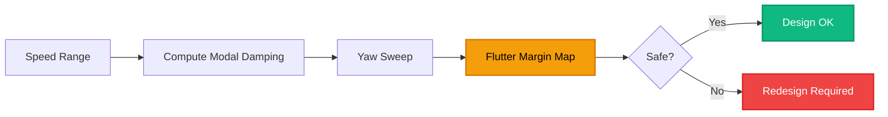
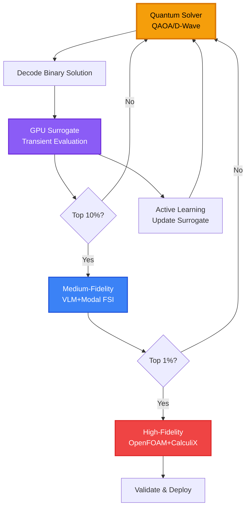

# Transient Aerodynamics & Aeroelastic Phenomena for F1

## Overview

Transient aerodynamic phenomena occur during dynamic maneuvers such as corner exits, DRS activation, and ride height changes. Understanding and optimizing these transient effects is crucial for maximizing F1 performance during real-world racing conditions.

---

## 1. Key Transient Aeroelastic Phenomena

### 1.1 Transient Aerodynamics on Corner Exit

**Phenomenon**: Rapid acceleration out of corners changes:
- Ride height (suspension compression)
- Angle of attack (pitch dynamics)
- Bound circulation and wake reattachment

**Impact**: Time-dependent downforce and drag variations affect traction and acceleration.

**Transfer Function**:

$$
\frac{\Delta L(s)}{\Delta \dot{h}(s)} = H_{heave}(s), \quad \frac{\Delta L(s)}{\Delta \dot{\theta}(s)} = H_{pitch}(s)
$$

Where:
- $\Delta L$ = Change in downforce
- $\dot{h}$ = Heave rate (vertical velocity)
- $\dot{\theta}$ = Pitch rate

### 1.2 Dynamic Deformation Under Acceleration & Braking

**Inertial Coupling**:

$$
F_{inertial} = m \cdot a_{longitudinal}
$$

**Effect Chain**:
1. Longitudinal acceleration → Suspension compression change
2. Ride height alteration → Wing incidence change
3. Downforce/drag modification → Structural loading change

**Fatigue Consideration**:

$$
N_f = C \cdot (\Delta \sigma)^{-m}
$$

Where $N_f$ is cycles to failure under stress range $\Delta \sigma$.

### 1.3 Flutter & Buffeting Onset Maps

**Modal Damping vs. Speed**:

$$
\zeta_i(V, \psi) = \zeta_{structural} + \zeta_{aero}(V, \psi)
$$

Where:
- $V$ = Airspeed
- $\psi$ = Yaw angle (cornering)
- $\zeta_{aero}$ = Aerodynamic damping (can be negative)

**Flutter Condition**:

$$
\zeta_i(V_f, \psi) = 0 \quad \text{(neutral stability)}
$$

**V-g Diagram**: Plot of velocity vs. damping for each mode.



### 1.4 Vortex-Structure Coupling & VIV

**Vortex Shedding Frequency** (Strouhal relation):

$$
f_{shed} = \frac{St \cdot V}{D}
$$

Where:
- $St$ ≈ 0.2 (typical for bluff bodies)
- $D$ = Characteristic dimension

**Lock-in Condition**:

$$
\left|\frac{f_{shed}}{f_{natural}} - 1\right| < 0.1
$$

**Affected Components**:
- Mirrors
- Small winglets
- Floor edges
- Endplates

### 1.5 DRS / Active Aero Coupling

**DRS Activation Transient**:

$$
\theta_{DRS}(t) = \begin{cases}
0° & t < t_{open} \\
\theta_{max} \cdot \frac{t - t_{open}}{\tau} & t_{open} \leq t < t_{open} + \tau \\
\theta_{max} & t \geq t_{open} + \tau
\end{cases}
$$

**Impulsive Load**:

$$
\Delta F_{impulse} = \int_{t_{open}}^{t_{open}+\tau} \frac{\partial F}{\partial \theta} \frac{d\theta}{dt} dt
$$

**Modal Excitation**: Rapid DRS deployment can excite structural modes.

### 1.6 Suspension-Aero Two-Way Coupling

**Suspension Model** (quarter-car):

$$
m\ddot{z} + c\dot{z} + kz = F_{aero}(z, \dot{z}) + F_{road}
$$

**Aerodynamic Load Dependency**:

$$
F_{aero}(z) = F_0 + \frac{\partial F}{\partial z}\Delta z + \frac{1}{2}\frac{\partial^2 F}{\partial z^2}\Delta z^2
$$

**Control Variables**:
- Ride height setpoint
- Damper coefficients
- Spring stiffness

---

## 2. Latest Advances & References

### 2.1 Neural Surrogate Approaches

**NeuralConcept** - Geometric deep learning for aerodynamics:
- Predicts pressure and vorticity fields on complex geometries
- 1000x faster than CFD
- Enables many-query optimization loops

**Architecture**: Graph Convolutional Networks (GCN) on mesh

$$
h_i^{(l+1)} = \sigma\left(\sum_{j \in \mathcal{N}(i)} W^{(l)} h_j^{(l)} + b^{(l)}\right)
$$

### 2.2 Transient Aero Devices Modeling

**DRS Deployment Simulation**:
- Transient CFD with moving boundaries
- Impulsive load characterization
- Wake evolution tracking

**Key Finding**: Transient deployment creates 20-30% higher peak loads than steady-state.

### 2.3 Floor Vortex Dynamics

**Unsteady Shear Layers**:
- Critical for performance in cornering
- Affects buffeting and noise
- Important for overtaking scenarios

**Vortex Core Tracking**:

$$
\Gamma = \oint_C \mathbf{v} \cdot d\mathbf{l}
$$

---

## 3. Multi-Fidelity Modeling Pipeline

### High-Fidelity FSI (Validation)

**Tools**: OpenFOAM + CalculiX + preCICE

**Transient Cases**:
1. Corner exit acceleration (150 → 220 km/h)
2. DRS open/close cycle
3. Sudden ride-height change (bump/kerb)

**Computational Cost**: 6-24 hours per case

### Medium-Fidelity (Fast Experiments)

**Unsteady VLM + Modal Response**:
- Wagner/Theodorsen functions for circulatory response
- Modal structural dynamics
- Flutter margin estimation

**Computational Cost**: 10-60 minutes per case

### ROM / Surrogate

**Architecture**: Geo-CNN + LSTM for temporal dynamics

**Mapping**:

$$
[\text{geometry}, \mathbf{q}(t), V(t), \psi(t)] \xrightarrow{\text{Neural Net}} \mathbf{F}_{aero}(t)
$$

**Training**: POD/DMD on vorticity fields + supervised learning

**Computational Cost**: <1 second per evaluation

---

## 4. Transient Test Cases

### Test Case 1: Corner Exit Throttle Step

**Scenario**:
- Initial speed: 150 km/h
- Final speed: 220 km/h
- Acceleration time: 2.5 seconds
- Yaw angle: 3°
- Initial ride height: 5mm lower than static

**Metrics**:
- Peak downforce reduction
- Time to recover 95% downforce
- Maximum structural displacement
- Modal energy growth

### Test Case 2: DRS Activation Cycle

**Sequence**:
1. Closed (baseline) - 2 seconds
2. Opening transition - 0.3 seconds
3. Open (steady) - 5 seconds
4. Closing transition - 0.3 seconds
5. Closed (recovery) - 2 seconds

**Metrics**:
- Impulsive load magnitude
- Wake evolution time constant
- Drag reduction effectiveness
- Structural stress peaks

### Test Case 3: Pothole / Kerb Event

**Input**: Vertical impulse (50mm displacement, 0.05s duration)

**Metrics**:
- Coupled structural response
- Short-term aero change
- Recovery time
- Fatigue damage increment

### Test Case 4: Yaw Sweep

**Profile**: Slow yaw ramp (0° → 10° over 5 seconds)

**Metrics**:
- Mode coupling evolution
- Shedding frequency changes
- Vortex core trajectory
- Flutter margin variation

---

## 5. Quantum/Hybrid Optimization Integration

### Decision Variables

#### Discrete Variables (Binary Encoding)
- Stiffener placement: $s_i \in \{0,1\}$
- Ply orientation bins: $\theta_i \in \{0°, 45°, 90°\}$
- DRS timing sequence: $t_{open,i} \in \{t_1, t_2, \ldots, t_n\}$

#### Continuous Variables (Binned)
- Flap angles: $\alpha \in [0°, 15°]$ → 8 bins
- Spar thickness: $t \in [1mm, 3mm]$ → 5 bins

### Multi-Objective Cost Function

$$
\text{Cost} = \alpha \cdot \overline{D} - \beta \cdot \overline{L} + \gamma \cdot \max(0, V_{target} - V_f) + \delta \cdot \text{disp}_{max} + \eta \cdot m
$$

Where:
- $\overline{D}, \overline{L}$ = Time-averaged drag and downforce over transient
- $V_f$ = Flutter speed
- $\text{disp}_{max}$ = Maximum displacement
- $m$ = Total mass

### QUBO Formulation

**Binary Encoding Example** (stiffener placement):

$$
H_{\text{QUBO}} = \sum_{i=1}^{N} h_i s_i + \sum_{i<j} J_{i,j} s_i s_j
$$

Where:
- $h_i$ = Local cost (mass penalty)
- $J_{i,j}$ = Interaction term (structural coupling)

**Surrogate Approximation**:

$$
V_f(\mathbf{s}) \approx V_{f,0} + \sum_i \frac{\partial V_f}{\partial s_i} s_i + \sum_{i<j} \frac{\partial^2 V_f}{\partial s_i \partial s_j} s_i s_j
### Hybrid Optimization Loop



---

## 6. Experimental & Data Strategy

### Instrumentation Plan

| Sensor Type | Location | Sampling Rate | Purpose |
|-------------|----------|---------------|---------|
| **Pressure Taps** | Wing surfaces (50+ points) | 1 kHz | Transient pressure distribution |
| **Accelerometers** | Wing tips, floor edges | 2 kHz | Structural vibration |
| **Strain Gauges** | Spar attachments | 1 kHz | Stress monitoring |
| **LDV/Doppler** | Wake region | 500 Hz | Vortex tracking |
| **High-Speed Camera** | Flow visualization | 1000 fps | PIV/smoke visualization |

### Training Dataset Generation

**Design of Experiments (DOE)**:
- Geometry variations: 50 designs
- Structural layouts: 20 configurations
- Speed range: 100-300 km/h (10 points)
- Yaw angles: 0°-10° (5 points)
- DRS states: closed, open, transitioning
- Transient events: 4 types

**Total HF FSI Runs**: ~2000 simulations

**Surrogate Training**:
- 80% training, 20% validation
- Temporal GNN architecture
- GPU training time: 2-3 days on RTX 4090

---

## 7. UI/App Enhancements

### Transient Scenario Runner

**Presets**:
- Corner Exit (low/medium/high severity)
- DRS Cycle (standard/aggressive)
- Kerb Strike (small/large bump)
- Yaw Sweep (slow/fast)

**Interactive Controls**:
- Speed sliders
- Yaw angle input
- Ride height adjustment
- DRS timing editor

### Mode Viewer with Time Playback

**Features**:
- Animated modal deformation
- Flow field overlay (vorticity, pressure)
- Time scrubber
- Export animation

### Flutter Margin Heatmap

**Axes**:
- X: Speed (100-300 km/h)
- Y: Configuration parameter
- Color: Flutter margin (%)

**Interactive**:
- Click to see mode shapes
- Hover for detailed metrics

### DRS Sequencing Editor

**Timeline Interface**:
- Drag-and-drop DRS events
- Timing constraints
- Optimization variable toggle

### Uncertainty & Trust Indicator

**Surrogate Confidence**:

$$
\sigma_{pred} = \sqrt{\text{Var}[f(\mathbf{x})]}
$$

**Visual Indicator**:
- Green: High confidence (<5% error)
- Yellow: Medium confidence (5-10% error)
- Red: Low confidence (>10% error) → Flag for HF validation

---

## 8. Implementation Roadmap

### Week 1-2: Transient Test Cases

- [ ] Script medium-fidelity unsteady VLM
- [ ] Implement modal coupling
- [ ] Run pilot corner-exit case
- [ ] Validate against literature

### Week 3-4: HF FSI Data Generation

- [ ] Set up OpenFOAM + CalculiX + preCICE
- [ ] Run 50 initial HF FSI cases
- [ ] Extract time-series data
- [ ] Build initial dataset

### Week 5-6: Surrogate Training

- [ ] Implement Geo-CNN + LSTM architecture
- [ ] Train on RTX GPU
- [ ] Validate temporal predictions
- [ ] Achieve <10% error target

### Week 7-10: Quantum Integration

- [ ] Encode discrete variables as QUBO
- [ ] Test on quantum simulators
- [ ] Integrate with surrogate loop
- [ ] Benchmark vs. classical optimization

### Week 11-12: Validation & Iteration

- [ ] Validate top designs with HF FSI
- [ ] Active learning refinement
- [ ] UI integration
- [ ] Documentation

---

## 9. Mathematical Formulations

### Fluid Dynamics (Incompressible Navier-Stokes)

$$
\rho\left(\frac{\partial \mathbf{v}}{\partial t} + (\mathbf{v} \cdot \nabla)\mathbf{v}\right) = -\nabla p + \mu \nabla^2 \mathbf{v} + \mathbf{f}
$$

$$
\nabla \cdot \mathbf{v} = 0
$$

### Structural Dynamics (Linear Elastodynamics)

$$
\mathbf{M}\ddot{\mathbf{u}}(t) + \mathbf{C}\dot{\mathbf{u}}(t) + \mathbf{K}\mathbf{u}(t) = \mathbf{F}_{aero}(t)
$$

For geometric nonlinearity: $\mathbf{K} \rightarrow \mathbf{K}(\mathbf{u})$

### Fluid-Structure Interaction (Partitioned)

**Coupling Equations**:

$$
\begin{cases}
\mathcal{F}(\mathbf{v}, p; \mathbf{u}) = 0 & \text{(fluid)} \\
\mathcal{S}(\mathbf{u}; \mathbf{F}_{aero}(\mathbf{v}, p)) = 0 & \text{(structure)}
\end{cases}
$$

**Aerodynamic Force Projection**:

$$
\mathbf{F}_{aero} = \int_{\Gamma} \mathbf{N}^T \mathbf{t}_{aero}(\mathbf{x}, t) \, d\Gamma
$$

### Modal Reduction (Structural ROM)

**Modal Expansion**:

$$
\mathbf{u}(t) \approx \mathbf{\Phi} \mathbf{q}(t)
$$

**Reduced Equations**:

$$
\underbrace{\mathbf{\Phi}^T \mathbf{M} \mathbf{\Phi}}_{\mathbf{M}_r} \ddot{\mathbf{q}}(t) + \underbrace{\mathbf{\Phi}^T \mathbf{C} \mathbf{\Phi}}_{\mathbf{C}_r} \dot{\mathbf{q}}(t) + \underbrace{\mathbf{\Phi}^T \mathbf{K} \mathbf{\Phi}}_{\mathbf{K}_r} \mathbf{q}(t) = \underbrace{\mathbf{\Phi}^T \mathbf{F}_{aero}(t)}_{\mathbf{F}_r(t)}
$$

**Generalized Aerodynamic Forces**:

$$
F_{r,i}(t) = \int_{\Gamma} \boldsymbol{\phi}_i \cdot \mathbf{t}_{aero}(\mathbf{x}, t) \, d\Gamma
$$

### Unsteady Aerodynamics (Wagner Function)

**Circulatory Lift Response** to step change in angle of attack:

$$
C_L(t) = C_{L,\infty} \cdot \Phi(t)
$$

Where Wagner function:

$$
\Phi(t) = 1 - 0.165 e^{-0.0455 \frac{Vt}{c}} - 0.335 e^{-0.3 \frac{Vt}{c}}
$$

---

## 10. Minimal Experiment (Ready to Run)

### Experiment Setup

**Case**: Corner-exit throttle step

**Parameters**:
- Initial speed: 160 km/h
- Final speed: 220 km/h
- Yaw: 3°
- Ride height: 5mm lower than static
- Duration: 1 second
- Timestep: 0.002 seconds (500 steps)

### Execution

```python
# Medium-fidelity simulation
def run_corner_exit_experiment():
    # Initialize
    vlm_solver = UnsteadyVLM(geometry, n_panels=1000)
    modal_solver = ModalDynamics(modes=5, damping=0.02)
    
    # Time integration
    t = 0
    dt = 0.002
    results = {'time': [], 'downforce': [], 'displacement': []}
    
    while t < 1.0:
        # Update speed (linear ramp)
        V = 160 + (220 - 160) * t
        
        # Compute aerodynamic loads
        F_aero = vlm_solver.compute_loads(V, yaw=3.0, ride_height=-5)
        
        # Update structural response
        q, q_dot = modal_solver.step(F_aero, dt)
        
        # Extract metrics
        downforce = F_aero[2]  # Z-component
        displacement = modal_solver.get_max_displacement(q)
        
        results['time'].append(t)
        results['downforce'].append(downforce)
        results['displacement'].append(displacement)
        
        t += dt
    
    return results
```

### Metrics to Extract

1. **Peak Downforce Reduction**: $\max(\Delta L) / L_0$
2. **Modal Energy Growth**: $E_{modal}(t) = \frac{1}{2}\mathbf{q}^T\mathbf{K}_r\mathbf{q}$
3. **Shedding Frequency**: FFT of pressure time series
4. **Flutter Indicator**: Positive modal energy growth rate

### Optimization Test

**Binary Choice**: Add transverse stiffener on mainplane (on/off)

**QUBO**:

$$
H = h_0 + h_1 s_1 \quad \text{where } s_1 \in \{0,1\}
$$

- $h_0$ = Baseline cost (no stiffener)
- $h_1$ = Cost change with stiffener (includes mass penalty and flutter benefit)

**Objective**: Minimize peak transient downforce loss while respecting mass budget.

---

## 11. Key References

1. **NeuralConcept** - Geometric deep learning for F1 aerodynamics
2. **COMSOL Blog** - Modeling DRS and active aerodynamic elements
3. **SAE International** - Transient aerodynamics of moving aero devices
4. **MDPI** - DRS effects on drag and lift
5. **ResearchGate** - Unsteady vortex dynamics and F1 floor behavior
6. **WES (Wind Energy Science)** - High-frequency sensing and modal detection

---

## 12. Conclusion

Transient aeroelastic phenomena are critical for F1 performance during real-world racing conditions. By integrating:

- **Multi-fidelity modeling** (HF FSI, medium-fidelity VLM, ROM surrogates)
- **Quantum optimization** for discrete design variables
- **Active learning** for surrogate refinement
- **Comprehensive instrumentation** for validation

We create a platform that enables F1 teams to optimize not just for steady-state conditions, but for the dynamic, transient scenarios that determine race outcomes.

**The future of F1 aerodynamics is transient-aware, quantum-optimized, and validated by real-world data.**

---

## 13. Additional Aeroelastic Equations and Formulations
1. Fluid dynamics (incompressible Navier–Stokes)

Velocity field 
v(x,t)
v(x,t), pressure 
p(x,t)
p(x,t), density 
ρ
ρ, viscosity 
μ
μ:

ρ(∂v∂t+(v⋅∇)v)	=−∇p+μ∇2v+f,
∇⋅v	=0.
ρ(
∂t
∂v
	​

+(v⋅∇)v)
∇⋅v
	​

=−∇p+μ∇
2
v+f,
=0.
	​


For low-Mach F1 external flows this incompressible form is usually sufficient.

2. Structural dynamics (linear elastodynamics)

Displacement field 
u(x,t)
u(x,t), mass 
M
M, damping 
C
C, stiffness 
K
K, aerodynamic forcing 
Faero
F
aero
	​

:

M u¨(t)+C u˙(t)+K u(t)=Faero(t).
M
u
¨
(t)+C
u
˙
(t)+Ku(t)=F
aero
	​

(t).

This is the standard FEM structural ODE. For geometric nonlinearity include nonlinear stiffness 
K(u)
K(u).

3. Fluid–Structure interaction (partitioned view)

At each time step:

Solve fluid on current geometry 
→
→ compute aerodynamic surface traction 
taero(x,t)
t
aero
	​

(x,t).

Project traction into structural DOFs: 
Faero=∫ΓN⊤taero dΓ
F
aero
	​

=∫
Γ
	​

N
⊤
t
aero
	​

dΓ.

Solve structure 
→
→ update 
u
u and mesh geometry.

The coupling can be written symbolically:

{F(v,p; u)=0	(fluid),
S(u; Faero(v,p))=0	(structure).
{
F(v,p;u)=0
S(u;F
aero
	​

(v,p))=0
	​

(fluid),
(structure).
	​

4. Modal reduction (structural ROM)

Assume a modal basis 
Φ
Φ and reduce 
u(t)≈Φq(t)
u(t)≈Φq(t) with modal coordinates 
q
q:

Φ⊤MΦ⏟Mrq¨(t)+Φ⊤CΦ⏟Crq˙(t)+Φ⊤KΦ⏟Krq(t)=Φ⊤Faero(t)⏟Fr(t).
M
r
	​


---

## 13. Additional Aeroelastic Equations and Formulations

### 13.1 Fluid Dynamics (Incompressible Navier-Stokes)

Velocity field $\mathbf{v}(\mathbf{x},t)$, pressure $p(\mathbf{x},t)$, density $\rho$, viscosity $\mu$:

$$
\rho\left(\frac{\partial \mathbf{v}}{\partial t} + (\mathbf{v} \cdot \nabla)\mathbf{v}\right) = -\nabla p + \mu \nabla^2 \mathbf{v} + \mathbf{f}
$$

$$
\nabla \cdot \mathbf{v} = 0
$$

For low-Mach F1 external flows, this incompressible form is usually sufficient.

### 13.2 Structural Dynamics (Linear Elastodynamics)

Displacement field $\mathbf{u}(\mathbf{x},t)$, mass $\mathbf{M}$, damping $\mathbf{C}$, stiffness $\mathbf{K}$, aerodynamic forcing $\mathbf{F}_{aero}$:

$$
\mathbf{M}\ddot{\mathbf{u}}(t) + \mathbf{C}\dot{\mathbf{u}}(t) + \mathbf{K}\mathbf{u}(t) = \mathbf{F}_{aero}(t)
$$

This is the standard FEM structural ODE. For geometric nonlinearity, include nonlinear stiffness $\mathbf{K}(\mathbf{u})$.

### 13.3 Fluid-Structure Interaction (Partitioned View)

At each time step:

1. Solve fluid on current geometry → compute aerodynamic surface traction $\mathbf{t}_{aero}(\mathbf{x},t)$
2. Project traction into structural DOFs:

$$
\mathbf{F}_{aero} = \int_{\Gamma} \mathbf{N}^T \mathbf{t}_{aero} \, d\Gamma
$$

3. Solve structure → update $\mathbf{u}$ and mesh geometry

The coupling can be written symbolically:

$$
\begin{cases}
\mathcal{F}(\mathbf{v}, p; \mathbf{u}) = 0 & \text{(fluid)} \\
\mathcal{S}(\mathbf{u}; \mathbf{F}_{aero}(\mathbf{v}, p)) = 0 & \text{(structure)}
\end{cases}
$$

### 13.4 Modal Reduction (Structural ROM)

Assume a modal basis $\mathbf{\Phi}$ and reduce $\mathbf{u}(t) \approx \mathbf{\Phi}\mathbf{q}(t)$ with modal coordinates $\mathbf{q}$:

$$
\underbrace{\mathbf{\Phi}^T \mathbf{M} \mathbf{\Phi}}_{\mathbf{M}_r} \ddot{\mathbf{q}}(t) + \underbrace{\mathbf{\Phi}^T \mathbf{C} \mathbf{\Phi}}_{\mathbf{C}_r} \dot{\mathbf{q}}(t) + \underbrace{\mathbf{\Phi}^T \mathbf{K} \mathbf{\Phi}}_{\mathbf{K}_r} \mathbf{q}(t) = \underbrace{\mathbf{\Phi}^T \mathbf{F}_{aero}(t)}_{\mathbf{F}_r(t)}
$$

Where:
- $\mathbf{M}_r$ = Reduced mass matrix
- $\mathbf{C}_r$ = Reduced damping matrix
- $\mathbf{K}_r$ = Reduced stiffness matrix
- $\mathbf{F}_r(t)$ = Generalized aerodynamic forces

**Modal Equation of Motion**:

$$
\ddot{\mathbf{q}}(t) + 2\zeta\omega_n\dot{\mathbf{q}}(t) + \omega_n^2\mathbf{q}(t) = \mathbf{M}_r^{-1}\mathbf{F}_r(t)
$$

Where $\zeta$ is the damping ratio and $\omega_n$ is the natural frequency.

