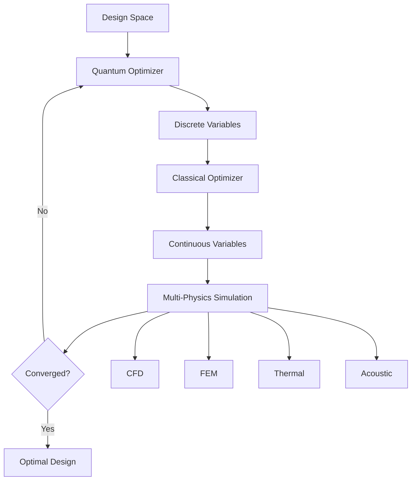

# Vibrations, Thermal Effects & Aeroacoustics for F1 Quantum-Aero Prototype

**Document Version**: 1.0  
**Date**: November 26, 2025  
**Status**: Technical Specification

---

## 📋 Table of Contents

1. [Overview](#overview)
2. [Structural Vibrations](#structural-vibrations)
3. [Thermal Effects & Aerothermal Coupling](#thermal-effects--aerothermal-coupling)
4. [Aeroacoustics](#aeroacoustics)
5. [Multi-Physics Coupling](#multi-physics-coupling)
6. [Quantum-Enhanced Optimization](#quantum-enhanced-optimization)
7. [Implementation Strategy](#implementation-strategy)
8. [Performance Targets](#performance-targets)

---

## 🎯 Overview

### Scope

This document addresses three critical multi-physics phenomena in F1 aerodynamics:

1. **Structural Vibrations**: Modal analysis, resonance, fatigue
2. **Thermal Effects**: Heat transfer, thermal expansion, aerothermal coupling
3. **Aeroacoustics**: Noise generation, propagation, regulatory compliance

### Importance for F1

**Vibrations**:
- Driver comfort and performance
- Structural fatigue and reliability
- Sensor accuracy (pressure taps, accelerometers)
- Aeroelastic coupling (flutter, buffeting)

**Thermal Effects**:
- Brake cooling efficiency
- Tire temperature management
- Power unit thermal management
- Aerodynamic surface temperature effects
- Material property changes with temperature

**Aeroacoustics**:
- FIA noise regulations (110 dB limit)
- Driver communication
- Aerodynamic efficiency indicators
- Flow separation detection

---

## 🔊 1. Structural Vibrations

### 1.1 Modal Analysis

#### Natural Frequencies and Mode Shapes

**Governing Equation** (Free Vibration):

$$
\mathbf{M}\ddot{\mathbf{u}} + \mathbf{K}\mathbf{u} = \mathbf{0}
$$

Where:
- $\mathbf{M}$ = Mass matrix
- $\mathbf{K}$ = Stiffness matrix
- $\mathbf{u}$ = Displacement vector

**Eigenvalue Problem**:

$$
(\mathbf{K} - \omega_n^2 \mathbf{M})\boldsymbol{\phi}_n = \mathbf{0}
$$

Where:
- $\omega_n$ = Natural frequency (rad/s)
- $\boldsymbol{\phi}_n$ = Mode shape vector
- $f_n = \frac{\omega_n}{2\pi}$ = Natural frequency (Hz)

#### Key F1 Components and Typical Frequencies

| Component | Frequency Range | Critical Modes |
|-----------|----------------|----------------|
| Front Wing | 15-50 Hz | 1st bending, 1st torsion |
| Rear Wing | 20-60 Hz | 1st bending, 1st torsion |
| Floor | 30-80 Hz | 1st bending, edge modes |
| Suspension | 10-25 Hz | Heave, pitch, roll |
| Diffuser | 40-100 Hz | Panel modes |

### 1.2 Forced Vibration Response

**Equation of Motion** (with damping):

$$
\mathbf{M}\ddot{\mathbf{u}} + \mathbf{C}\dot{\mathbf{u}} + \mathbf{K}\mathbf{u} = \mathbf{F}(t)
$$

Where:
- $\mathbf{C}$ = Damping matrix
- $\mathbf{F}(t)$ = Time-dependent force vector (aerodynamic, road, engine)

**Modal Damping**:

$$
\zeta_n = \frac{c_n}{2\sqrt{k_n m_n}}
$$

Typical F1 damping ratios: $\zeta_n = 0.01 - 0.05$ (1-5% critical damping)

### 1.3 Resonance and Frequency Response

**Frequency Response Function (FRF)**:

$$
H(\omega) = \frac{U(\omega)}{F(\omega)} = \frac{1}{k - \omega^2 m + i\omega c}
$$

**Resonance Condition**: $\omega \approx \omega_n$

**Amplification Factor** at resonance:

$$
A = \frac{1}{2\zeta_n}
$$

For $\zeta_n = 0.02$ (2%), amplification = 25x

### 1.4 Vibration Sources in F1

#### Aerodynamic Excitation

1. **Vortex Shedding**:
   $$
   f_{shed} = \frac{St \cdot V}{D}
   $$
   
   Strouhal number: $St \approx 0.2$ for bluff bodies

2. **Turbulent Buffeting**:
   - Broadband excitation (10-500 Hz)
   - Wake interactions
   - Separated flow regions

3. **DRS Actuation**:
   - Impulsive loads during opening/closing
   - Transient response (0.1-0.3 seconds)

#### Mechanical Excitation

1. **Engine Vibration**:
   - V6 turbo: 3 × RPM/60 Hz (3rd order)
   - At 12,000 RPM: 600 Hz fundamental

2. **Road Irregularities**:
   - Kerbs: 5-15 Hz
   - Track surface: 20-100 Hz

3. **Tire Imbalance**:
   - Wheel rotation frequency: V/(2πR)
   - At 300 km/h, R=0.33m: ~40 Hz

### 1.5 Vibration-Induced Fatigue

**S-N Curve** (Stress-Life):

$$
N = C \cdot S^{-m}
$$

Where:
- $N$ = Number of cycles to failure
- $S$ = Stress amplitude
- $C, m$ = Material constants

**Palmgren-Miner Rule** (cumulative damage):

$$
D = \sum_{i=1}^{k} \frac{n_i}{N_i}
$$

Failure occurs when $D \geq 1$

**Carbon Fiber Composites**:
- High cycle fatigue (HCF): $N > 10^6$ cycles
- Typical F1 race: ~2 hours × 100 Hz = 720,000 cycles

### 1.6 Vibration Mitigation Strategies

1. **Frequency Detuning**:
   - Shift natural frequencies away from excitation
   - Target: $|f_n - f_{excite}| > 20\%$

2. **Damping Enhancement**:
   - Viscoelastic materials
   - Constrained layer damping
   - Target: $\zeta_n > 0.03$

3. **Mass Tuning**:
   - Tuned mass dampers (TMD)
   - Dynamic vibration absorbers

4. **Stiffness Optimization**:
   - Topology optimization
   - Quantum-assisted design

---

## 🌡️ 2. Thermal Effects & Aerothermal Coupling

### 2.1 Heat Transfer Fundamentals

#### Conduction

**Fourier's Law**:

$$
\mathbf{q} = -k \nabla T
$$

**Heat Equation**:

$$
\rho c_p \frac{\partial T}{\partial t} = \nabla \cdot (k \nabla T) + \dot{q}_{gen}
$$

Where:
- $k$ = Thermal conductivity [W/(m·K)]
- $c_p$ = Specific heat [J/(kg·K)]
- $\dot{q}_{gen}$ = Heat generation rate [W/m³]

#### Convection

**Newton's Law of Cooling**:

$$
q'' = h(T_s - T_\infty)
$$

**Nusselt Number**:

$$
Nu = \frac{hL}{k} = f(Re, Pr)
$$

**Typical F1 Convection Coefficients**:
- Front wing: $h = 100-500$ W/(m²·K)
- Brake ducts: $h = 500-2000$ W/(m²·K)
- Underbody: $h = 200-800$ W/(m²·K)

#### Radiation

**Stefan-Boltzmann Law**:

$$
q'' = \epsilon \sigma (T_s^4 - T_\infty^4)
$$

Where:
- $\epsilon$ = Emissivity (carbon fiber: 0.8-0.9)
- $\sigma = 5.67 \times 10^{-8}$ W/(m²·K⁴)

### 2.2 Thermal Expansion

**Linear Thermal Expansion**:

$$
\Delta L = \alpha L_0 \Delta T
$$

**Thermal Strain**:

$$
\boldsymbol{\epsilon}_{th} = \alpha \Delta T \mathbf{I}
$$

**Thermal Stress** (constrained):

$$
\boldsymbol{\sigma}_{th} = -E \alpha \Delta T \mathbf{I}
$$

**Material Properties**:

| Material | $\alpha$ [10⁻⁶/K] | $E$ [GPa] | $k$ [W/(m·K)] |
|----------|-------------------|-----------|---------------|
| Carbon Fiber (axial) | 0-2 | 150-250 | 10-20 |
| Carbon Fiber (transverse) | 20-30 | 10-15 | 0.5-1.0 |
| Aluminum | 23 | 70 | 200 |
| Titanium | 8.6 | 110 | 22 |

### 2.3 Aerothermal Coupling

#### Temperature-Dependent Air Properties

**Density**:

$$
\rho(T) = \frac{p}{R T}
$$

**Viscosity** (Sutherland's Law):

$$
\mu(T) = \mu_0 \left(\frac{T}{T_0}\right)^{3/2} \frac{T_0 + S}{T + S}
$$

Where $S = 110.4$ K for air

**Impact on Aerodynamics**:
- 10°C temperature rise → 3% density decrease
- Downforce reduction: ~1-2%
- Drag reduction: ~0.5-1%

#### Adiabatic Wall Temperature

**Recovery Factor**:

$$
r = \frac{T_{aw} - T_\infty}{T_0 - T_\infty}
$$

Where:
- $T_{aw}$ = Adiabatic wall temperature
- $T_0$ = Stagnation temperature
- $r \approx \sqrt{Pr}$ for laminar, $r \approx Pr^{1/3}$ for turbulent

**At 300 km/h** (83.3 m/s):

$$
T_0 - T_\infty = \frac{V^2}{2c_p} \approx 3.5 \text{ K}
$$

### 2.4 Critical Thermal Management Areas

#### Brake Cooling

**Heat Generation**:

$$
\dot{Q}_{brake} = \frac{1}{2}m V^2 \cdot \frac{1}{\Delta t}
$$

For 800 kg car, 300 → 100 km/h in 2 seconds:
$$
\dot{Q}_{brake} \approx 1.5 \text{ MW}
$$

**Brake Temperature**:
- Operating range: 400-800°C
- Peak temperatures: 1000°C+
- Critical for pad performance and disc life

**Cooling Requirements**:
- Front brake ducts: 50-100 L/s airflow
- Rear brake ducts: 30-60 L/s airflow

#### Tire Temperature

**Optimal Operating Window**:
- Surface temperature: 90-110°C
- Core temperature: 80-100°C

**Heat Sources**:
1. Friction with track
2. Tire deformation (hysteresis)
3. Aerodynamic heating

**Cooling Mechanisms**:
1. Convection to air
2. Conduction to rim
3. Radiation

#### Power Unit Thermal Management

**Cooling Requirements**:
- ICE: 100-150 kW
- MGU-K: 20-30 kW
- MGU-H: 10-15 kW
- Turbocharger: 30-50 kW

**Radiator Sizing**:

$$
\dot{Q} = \dot{m} c_p \Delta T = UA \Delta T_{lm}
$$

Where:
- $U$ = Overall heat transfer coefficient
- $A$ = Heat exchanger area
- $\Delta T_{lm}$ = Log mean temperature difference

### 2.5 Thermal Effects on Aerodynamic Surfaces

#### Surface Temperature Distribution

**Typical F1 Surface Temperatures**:
- Front wing: 30-50°C
- Floor (front): 40-70°C
- Floor (rear): 60-100°C
- Diffuser: 80-150°C
- Rear wing: 35-55°C

#### Material Property Changes

**Carbon Fiber Modulus** (temperature-dependent):

$$
E(T) = E_0 \left[1 - \beta(T - T_0)\right]
$$

Typical: $\beta \approx 0.001$ /K

**Impact on Aeroelasticity**:
- 50°C increase → 5% stiffness reduction
- Flutter speed reduction: ~2-3%

---

## 🔊 3. Aeroacoustics

### 3.1 Sound Generation Mechanisms

#### Lighthill's Acoustic Analogy

**Wave Equation**:

$$
\frac{1}{c_0^2}\frac{\partial^2 p'}{\partial t^2} - \nabla^2 p' = \frac{\partial^2 T_{ij}}{\partial x_i \partial x_j}
$$

Where:
- $p'$ = Acoustic pressure
- $T_{ij}$ = Lighthill stress tensor (source term)

**Lighthill Stress Tensor**:

$$
T_{ij} = \rho u_i u_j + (p - c_0^2 \rho')\delta_{ij} - \tau_{ij}
$$

#### Acoustic Power

**Lighthill's Eighth Power Law**:

$$
P_{acoustic} \propto \rho_0 V^8 L^2 / c_0^5
$$

Where:
- $V$ = Characteristic velocity
- $L$ = Characteristic length

**Implication**: Doubling speed increases acoustic power by 256x!

### 3.2 F1 Noise Sources

#### Engine Noise

**Dominant Frequencies**:
- Firing frequency: $f = \frac{n_{cyl} \cdot RPM}{120}$
- V6 at 12,000 RPM: 600 Hz
- Harmonics: 1200, 1800, 2400 Hz

**Sound Pressure Level (SPL)**:

$$
SPL = 20 \log_{10}\left(\frac{p_{rms}}{p_{ref}}\right) \text{ dB}
$$

Where $p_{ref} = 20 \times 10^{-6}$ Pa

**Current F1 Regulations**: 110 dB at 15m from track centerline

#### Aerodynamic Noise

1. **Turbulent Boundary Layer**:
   - Broadband noise (500-5000 Hz)
   - Scales with $V^6$

2. **Vortex Shedding**:
   - Tonal noise at shedding frequency
   - Mirrors, antennas, suspension components

3. **Cavity Resonance**:
   - Cockpit opening
   - Brake ducts
   - Cooling inlets

4. **Jet Noise**:
   - Exhaust
   - DRS gap flow
   - Diffuser exit

#### Tire Noise

**Mechanisms**:
- Tread pattern impact
- Air pumping
- Stick-slip friction
- Tire vibration

**Frequency Range**: 500-2000 Hz

### 3.3 Sound Propagation

#### Spherical Spreading

**Intensity Decay**:

$$
I(r) = \frac{P_{source}}{4\pi r^2}
$$

**SPL Decay**:

$$
SPL(r) = SPL(r_0) - 20\log_{10}\left(\frac{r}{r_0}\right)
$$

#### Atmospheric Absorption

**Attenuation Coefficient** (ISO 9613):

$$
\alpha = f^2 \left[\frac{1.84 \times 10^{-11}}{p_a} \left(\frac{T}{T_0}\right)^{1/2} + \left(\frac{T}{T_0}\right)^{-5/2} \times \text{(relaxation terms)}\right]
$$

**Typical Values** (20°C, 70% RH):
- 1 kHz: 0.01 dB/m
- 4 kHz: 0.1 dB/m

### 3.4 Aeroacoustic Optimization

#### Objectives

1. **Minimize Noise** (regulatory compliance)
2. **Maximize Aerodynamic Efficiency**
3. **Maintain Structural Integrity**

#### Design Variables

- Exhaust geometry
- Diffuser exit angle
- Wing trailing edge shape
- Endplate serrations
- Vortex generator placement

#### Constraints

- FIA noise limit: 110 dB
- Downforce requirement
- Drag budget
- Weight limit

### 3.5 Computational Aeroacoustics (CAA)

#### Numerical Methods

1. **Direct Noise Computation (DNC)**:
   - Solve compressible Navier-Stokes
   - High resolution required (10-20 points per wavelength)
   - Extremely expensive

2. **Hybrid Methods**:
   - CFD for flow field
   - Acoustic analogy for sound propagation
   - Ffowcs Williams-Hawkings (FW-H) equation

3. **Linearized Euler Equations (LEE)**:
   - Perturbation approach
   - Mean flow from RANS/LES

#### Ffowcs Williams-Hawkings Equation

**Integral Formulation**:

$$
p'(\mathbf{x}, t) = p'_T(\mathbf{x}, t) + p'_L(\mathbf{x}, t) + p'_Q(\mathbf{x}, t)
$$

Where:
- $p'_T$ = Thickness noise (volume displacement)
- $p'_L$ = Loading noise (surface forces)
- $p'_Q$ = Quadrupole noise (volume sources)

---

## 🔗 4. Multi-Physics Coupling

### 4.1 Vibro-Acoustic Coupling

**Coupled System**:

$$
\begin{bmatrix}
\mathbf{M}_s & \mathbf{0} \\\\
\rho_0 \mathbf{C}^T & \mathbf{M}_f
\end{bmatrix}
\begin{bmatrix}
\ddot{\mathbf{u}} \\\\
\ddot{\mathbf{p}}
\end{bmatrix}
+
\begin{bmatrix}
\mathbf{K}_s & -\mathbf{C} \\\\
\mathbf{0} & \mathbf{K}_f
\end{bmatrix}
\begin{bmatrix}
\mathbf{u} \\\\
\mathbf{p}
\end{bmatrix}
=
\begin{bmatrix}
\mathbf{F}_s \\\\
\mathbf{0}
\end{bmatrix}
$$

Where:
- $\mathbf{u}$ = Structural displacement
- $\mathbf{p}$ = Acoustic pressure
- $\mathbf{C}$ = Coupling matrix

### 4.2 Thermo-Mechanical Coupling

**Coupled Equations**:

1. **Heat Transfer**:
   $$
   \rho c_p \frac{\partial T}{\partial t} = \nabla \cdot (k \nabla T) + \dot{q}_{gen}
   $$

2. **Structural Mechanics**:
   $$
   \rho \ddot{\mathbf{u}} = \nabla \cdot \boldsymbol{\sigma} + \mathbf{f}
   $$
   
   With thermal strain: $\boldsymbol{\epsilon} = \boldsymbol{\epsilon}_{mech} + \boldsymbol{\epsilon}_{th}$

### 4.3 Aerothermoelastic Coupling

**Full Coupling**:

```
Aerodynamics → Heat Transfer → Thermal Expansion → Geometry Change → Aerodynamics
     ↓                                    ↓
  Pressure Loads                    Stiffness Change
     ↓                                    ↓
  Structural Deformation ← ← ← ← ← ← ← ← ←
```

**Governing Equations**:

1. **Fluid** (compressible Navier-Stokes with energy):
   $$
   \frac{\partial \rho}{\partial t} + \nabla \cdot (\rho \mathbf{v}) = 0
   $$
   $$
   \frac{\partial (\rho \mathbf{v})}{\partial t} + \nabla \cdot (\rho \mathbf{v} \otimes \mathbf{v}) = -\nabla p + \nabla \cdot \boldsymbol{\tau}
   $$
   $$
   \frac{\partial (\rho E)}{\partial t} + \nabla \cdot [(\rho E + p)\mathbf{v}] = \nabla \cdot (k \nabla T) + \nabla \cdot (\boldsymbol{\tau} \cdot \mathbf{v})
   $$

2. **Structure** (with thermal effects):
   $$
   \rho_s \ddot{\mathbf{u}} = \nabla \cdot \boldsymbol{\sigma}(\boldsymbol{\epsilon}_{mech}, T) + \mathbf{f}_{aero}
   $$

3. **Thermal**:
   $$
   \rho_s c_p \frac{\partial T}{\partial t} = \nabla \cdot (k_s \nabla T) + \dot{q}_{aero}
   $$

### 4.4 Partitioned vs. Monolithic Coupling

#### Partitioned (Staggered)

**Algorithm**:
```
For each time step:
  1. Solve fluid (fixed structure)
  2. Transfer loads to structure
  3. Solve structure (fixed fluid)
  4. Update mesh
  5. Check convergence
  6. Repeat if necessary
```

**Advantages**: Modular, use existing solvers
**Disadvantages**: Stability issues, sub-iterations required

#### Monolithic

**Solve coupled system simultaneously**:

$$
\begin{bmatrix}
\mathbf{A}_{ff} & \mathbf{A}_{fs} \\\\
\mathbf{A}_{sf} & \mathbf{A}_{ss}
\end{bmatrix}
\begin{bmatrix}
\mathbf{x}_f \\\\
\mathbf{x}_s
\end{bmatrix}
=
\begin{bmatrix}
\mathbf{b}_f \\\\
\mathbf{b}_s
\end{bmatrix}
$$

**Advantages**: Unconditionally stable
**Disadvantages**: Large system, complex implementation

---

## 🔬 5. Quantum-Enhanced Optimization

### 5.1 Multi-Physics Design Optimization

#### Objective Function

**Multi-Objective**:

$$
\min_{\mathbf{x}} \mathbf{F}(\mathbf{x}) = \begin{bmatrix}
-C_L(\mathbf{x}) \\\\
C_D(\mathbf{x}) \\\\
SPL(\mathbf{x}) \\\\
\sigma_{max}(\mathbf{x}) \\\\
T_{max}(\mathbf{x})
\end{bmatrix}
$$

Subject to:
- $f_{flutter} > 1.2 \times V_{max}$
- $SPL < 110$ dB
- $T_{brake} < 1000$ °C
- $\sigma_{max} < \sigma_{allow}$
- $m_{total} < m_{limit}$

#### Design Variables

**Discrete** (quantum-friendly):
- Stiffener placement (binary)
- Material selection (one-hot encoding)
- Cooling hole pattern (binary)

**Continuous** (classical optimization):
- Wing angles
- Thickness distribution
- Cooling flow rates

### 5.2 QUBO Formulation for Vibration Suppression

**Objective**: Minimize vibration amplitude while maintaining stiffness

$$
H_{QUBO} = \sum_{i=1}^{N} w_i x_i + \sum_{i<j} J_{ij} x_i x_j
$$

Where:
- $x_i = 1$ if stiffener at location $i$
- $w_i$ = Weight penalty
- $J_{ij}$ = Coupling (stiffness contribution)

**Constraints**:
- Total mass: $\sum_i m_i x_i \leq M_{max}$
- Minimum stiffness: $\sum_i k_i x_i \geq K_{min}$

### 5.3 Quantum Annealing for Thermal Topology

**Problem**: Optimal cooling channel layout

**Binary Variables**:
- $x_i = 1$ if material at voxel $i$
- $x_i = 0$ if cooling channel

**Objective**:

$$
\min \left[\alpha \cdot T_{max} + \beta \cdot \Delta p + \gamma \cdot m_{total}\right]
$$

**QUBO Encoding**:

$$
H = \sum_i h_i x_i + \sum_{i<j} J_{ij} x_i x_j
$$

Where:
- $h_i$ includes thermal conductivity, mass
- $J_{ij}$ includes connectivity, flow resistance

### 5.4 Hybrid Quantum-Classical Workflow



**Steps**:
1. Quantum solver proposes discrete design (stiffener layout, cooling pattern)
2. Classical optimizer refines continuous variables (angles, thicknesses)
3. Multi-physics simulation evaluates performance
4. Update surrogate models
5. Repeat until convergence

---

## 🛠️ 6. Implementation Strategy

### 6.1 Simulation Stack

#### Vibration Analysis

**Tools**:
- **Modal Analysis**: Abaqus, CalculiX, Code_Aster
- **Frequency Response**: Nastran, LS-DYNA
- **Time Integration**: Newmark-β, HHT-α

**Workflow**:
```python
# Pseudocode
def vibration_analysis(geometry, material, boundary_conditions):
    # 1. Modal analysis
    frequencies, mode_shapes = modal_solver(geometry, material)
    
    # 2. Check resonance
    excitation_freqs = get_excitation_frequencies()
    resonance_risk = check_resonance(frequencies, excitation_freqs)
    
    # 3. Forced response
    if resonance_risk:
        response = frequency_response_analysis(
            geometry, material, excitation_freqs
        )
        
        # 4. Fatigue assessment
        fatigue_life = fatigue_analysis(response, material)
    
    return frequencies, mode_shapes, fatigue_life
```

#### Thermal Analysis

**Tools**:
- **Conduction**: ANSYS Thermal, OpenFOAM
- **Conjugate Heat Transfer**: OpenFOAM, STAR-CCM+
- **Radiation**: View factor methods, Monte Carlo

**Workflow**:
```python
def thermal_analysis(geometry, flow_conditions, heat_sources):
    # 1. CFD for convection coefficients
    h_conv = cfd_solver(geometry, flow_conditions)
    
    # 2. Conjugate heat transfer
    T_distribution = cht_solver(
        geometry, h_conv, heat_sources, 
        boundary_conditions={'brake': 800, 'ambient': 25}
    )
    
    # 3. Thermal expansion
    thermal_strain = alpha * (T_distribution - T_ref)
    
    # 4. Thermo-mechanical coupling
    stress = fem_solver(geometry, thermal_strain, mechanical_loads)
    
    return T_distribution, stress
```

#### Aeroacoustic Analysis

**Tools**:
- **CFD**: OpenFOAM, STAR-CCM+, PowerFLOW
- **Acoustic Propagation**: Actran, COMSOL
- **Hybrid Methods**: FW-H equation implementation

**Workflow**:
```python
def aeroacoustic_analysis(geometry, flow_conditions):
    # 1. High-fidelity CFD (LES/DES)
    flow_field = les_solver(geometry, flow_conditions)
    
    # 2. Extract acoustic sources
    sources = extract_acoustic_sources(flow_field)
    
    # 3. FW-H propagation
    spl_field = fwh_solver(sources, observer_locations)
    
    # 4. Frequency analysis
    spectrum = fft(spl_field)
    
    # 5. Check compliance
    max_spl = max(spl_field)
    compliant = max_spl < 110  # dB
    
    return spl_field, spectrum, compliant
```

### 6.2 Multi-Fidelity Approach

| Fidelity | Vibration | Thermal | Acoustic | Cost |
|----------|-----------|---------|----------|------|
| **Low** | Beam theory | 1D thermal network | Empirical correlations | 1 min |
| **Medium** | FEM (modal) | 2D/3D conduction + convection BC | RANS + acoustic analogy | 1 hour |
| **High** | FEM (transient) | Conjugate heat transfer | LES + FW-H | 24 hours |

**Strategy**:
1. Screen designs with low-fidelity (1000s of candidates)
2. Refine with medium-fidelity (100s of candidates)
3. Validate with high-fidelity (10s of candidates)

### 6.3 Surrogate Modeling

#### Neural Network Architecture

**Input**: Geometry parameters (50-100 dimensions)
**Output**: Multi-physics quantities

```python
class MultiPhysicsSurrogate(nn.Module):
    def __init__(self):
        super().__init__()
        self.encoder = GCN(input_dim=3, hidden_dim=128, num_layers=3)
        
        # Separate heads for each physics
        self.vibration_head = nn.Sequential(
            nn.Linear(128, 64),
            nn.ReLU(),
            nn.Linear(64, 10)  # First 10 natural frequencies
        )
        
        self.thermal_head = nn.Sequential(
            nn.Linear(128, 64),
            nn.ReLU(),
            nn.Linear(64, 3)  # T_max, T_avg, T_gradient
        )
        
        self.acoustic_head = nn.Sequential(
            nn.Linear(128, 64),
            nn.ReLU(),
            nn.Linear(64, 1)  # SPL
        )
    
    def forward(self, geometry):
        features = self.encoder(geometry)
        
        frequencies = self.vibration_head(features)
        thermal = self.thermal_head(features)
        spl = self.acoustic_head(features)
        
        return {
            'frequencies': frequencies,
            'T_max': thermal[:, 0],
            'T_avg': thermal[:, 1],
            'T_gradient': thermal[:, 2],
            'SPL': spl
        }
```

#### Training Strategy

**Dataset**:
- 10,000 high-fidelity simulations
- Design of Experiments (DOE): Latin Hypercube Sampling
- Augmentation: Geometric perturbations

**Loss Function**:

$$
\mathcal{L} = \lambda_1 \mathcal{L}_{vib} + \lambda_2 \mathcal{L}_{thermal} + \lambda_3 \mathcal{L}_{acoustic}
$$

Where:
$$
\mathcal{L}_{vib} = \frac{1}{N}\sum_{i=1}^{N} \|\mathbf{f}_i^{pred} - \mathbf{f}_i^{true}\|^2
$$

**Physics-Informed Loss**:

$$
\mathcal{L}_{physics} = \|\omega_n^2 - \frac{k_n}{m_n}\|^2
$$

### 6.4 Docker Services

```yaml
# docker-compose.multiphysics.yml
version: '3.8'

services:
  vibration-service:
    build: ./services/vibration
    image: qaero/vibration:latest
    volumes:
      - ./data/meshes:/data/meshes
      - ./data/results:/data/results
    environment:
      - SOLVER=calculix
      - N_MODES=20
    deploy:
      resources:
        limits:
          cpus: '8'
          memory: 16G

  thermal-service:
    build: ./services/thermal
    image: qaero/thermal:latest
    volumes:
      - ./data/meshes:/data/meshes
      - ./data/results:/data/results
    environment:
      - SOLVER=openfoam
      - CHT_ENABLED=true
    deploy:
      resources:
        limits:
          cpus: '16'
          memory: 32G
        reservations:
          devices:
            - driver: nvidia
              count: 1
              capabilities: [gpu]

  acoustic-service:
    build: ./services/acoustic
    image: qaero/acoustic:latest
    volumes:
      - ./data/meshes:/data/meshes
      - ./data/results:/data/results
    environment:
      - SOLVER=openfoam
      - TURBULENCE_MODEL=LES
      - FWH_ENABLED=true
    deploy:
      resources:
        limits:
          cpus: '32'
          memory: 64G
        reservations:
          devices:
            - driver: nvidia
              count: 2
              capabilities: [gpu]

  multiphysics-orchestrator:
    build: ./services/orchestrator
    image: qaero/orchestrator:latest
    depends_on:
      - vibration-service
      - thermal-service
      - acoustic-service
    ports:
      - "8080:8080"
    environment:
      - COUPLING_METHOD=partitioned
      - MAX_ITERATIONS=10
      - CONVERGENCE_TOL=1e-4
```

---

## 📊 7. Performance Targets

### 7.1 Vibration Metrics

| Metric | Target | Rationale |
|--------|--------|-----------|
| Natural frequencies | > 1.5× excitation | Avoid resonance |
| Modal damping | > 2% critical | Limit amplification |
| Vibration amplitude | < 0.5 mm RMS | Driver comfort |
| Fatigue life | > 10 races | Reliability |
| Sensor noise | < 1% signal | Measurement accuracy |

### 7.2 Thermal Metrics

| Component | Target Temperature | Limit |
|-----------|-------------------|-------|
| Brake discs | 600-800°C | 1000°C |
| Brake pads | 400-600°C | 800°C |
| Tire surface | 90-110°C | 130°C |
| Carbon fiber | < 150°C | 200°C (degradation) |
| Power unit coolant | 90-110°C | 120°C |

### 7.3 Acoustic Metrics

| Metric | Target | Regulation |
|--------|--------|------------|
| Peak SPL | < 110 dB | FIA limit |
| Frequency range | 500-5000 Hz | Dominant range |
| Directivity | Minimize forward | Driver communication |
| Tonal content | < 10% | Subjective quality |

### 7.4 Computational Performance

| Analysis Type | Fidelity | Time Target | Accuracy Target |
|---------------|----------|-------------|-----------------|
| Modal analysis | Medium | 10 min | ±5% frequency |
| Thermal steady-state | Medium | 30 min | ±10°C |
| Thermal transient | High | 4 hours | ±5°C |
| Aeroacoustic | High | 24 hours | ±3 dB |
| Multi-physics coupled | High | 48 hours | ±10% integrated |

---

## 🎯 8. Validation & Testing

### 8.1 Experimental Validation

#### Vibration Testing

**Methods**:
- Impact hammer test (modal analysis)
- Shaker table (frequency response)
- Accelerometer arrays (operational modal analysis)

**Metrics**:
- Natural frequencies (±2% accuracy)
- Mode shapes (MAC > 0.9)
- Damping ratios (±20% accuracy)

#### Thermal Testing

**Methods**:
- Thermocouples (point measurements)
- Infrared thermography (surface fields)
- Heat flux sensors

**Metrics**:
- Temperature accuracy: ±2°C
- Spatial resolution: 1 mm
- Temporal resolution: 10 Hz

#### Acoustic Testing

**Methods**:
- Microphone arrays
- Sound intensity probes
- Beamforming

**Metrics**:
- SPL accuracy: ±1 dB
- Frequency resolution: 10 Hz
- Spatial resolution: 0.1 m

### 8.2 Benchmark Cases

#### Vibration Benchmarks

1. **Cantilever Beam**: Analytical solution available
2. **Plate Vibration**: Experimental data from literature
3. **F1 Wing Mock-up**: Wind tunnel + modal test

#### Thermal Benchmarks

1. **Flat Plate Convection**: Empirical correlations
2. **Cylinder in Cross-flow**: Experimental data
3. **Brake Disc Cooling**: Manufacturer data

#### Acoustic Benchmarks

1. **Cylinder Vortex Shedding**: Experimental data (Strouhal)
2. **Jet Noise**: NASA experimental database
3. **Cavity Resonance**: Analytical + experimental

---

## 📚 References

### Vibrations

1. Ewins, D.J. (2000). *Modal Testing: Theory, Practice and Application*. Research Studies Press.
2. Inman, D.J. (2014). *Engineering Vibration*. Pearson.
3. Maia, N.M.M., Silva, J.M.M. (1997). *Theoretical and Experimental Modal Analysis*. Research Studies Press.

### Thermal

4. Incropera, F.P., DeWitt, D.P. (2011). *Fundamentals of Heat and Mass Transfer*. Wiley.
5. Kays, W.M., Crawford, M.E. (1993). *Convective Heat and Mass Transfer*. McGraw-Hill.
6. Limpert, R. (2011). *Brake Design and Safety*. SAE International.

### Aeroacoustics

7. Lighthill, M.J. (1952). "On Sound Generated Aerodynamically". *Proc. Royal Society A*, 211(1107), 564-587.
8. Ffowcs Williams, J.E., Hawkings, D.L. (1969). "Sound Generation by Turbulence". *Phil. Trans. Royal Society A*, 264(1151), 321-342.
9. Wagner, C., Hüttl, T., Sagaut, P. (2007). *Large-Eddy Simulation for Acoustics*. Cambridge University Press.

### Multi-Physics

10. Bathe, K.J. (2014). *Finite Element Procedures*. Prentice Hall.
11. Zienkiewicz, O.C., Taylor, R.L. (2005). *The Finite Element Method*. Butterworth-Heinemann.
12. Felippa, C.A., Park, K.C., Farhat, C. (2001). "Partitioned Analysis of Coupled Mechanical Systems". *Computer Methods in Applied Mechanics*, 190(24-25), 3247-3270.

---

## 🔄 Revision History

| Version | Date | Changes | Author |
|---------|------|---------|--------|
| 1.0 | 2025-11-26 | Initial document creation | Cascade AI |

---

**This document provides the foundation for vibration, thermal, and aeroacoustic analysis in the Quantum-Aero F1 Prototype. Integration with quantum optimization and ML surrogates enables unprecedented multi-physics design optimization.**
