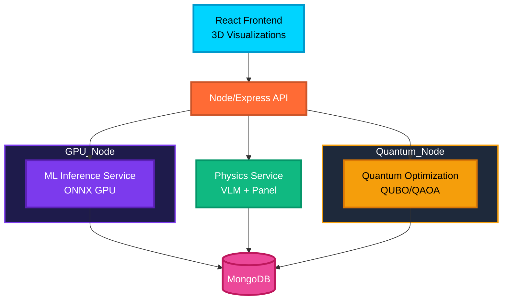

# 🏎️⚛️ Quantum-Aero F1 Prototype - Evolution Platform


[](Project_Development_Markdowns/IMPLEMENTATION_PROGRESS.md)
[](Project_Development_Markdowns/PROJECT_STATUS_WITH_EVOLUTION.md)
[](.)
[](.)

A revolutionary **AI + Quantum Computing + Real-Time CFD** platform for Formula 1 aerodynamic optimization. Combines Vision Transformers, Graph Neural Networks, Variational Quantum Eigensolvers, and advanced 3D visualizations into a production-ready system.

## 🚀 Evolution Roadmap (2026-2027)

**Current Status**: Phase 1 - 70% Complete | Overall - 32% Complete

### Phase 1: Advanced AI Surrogates (Q2 2026) - 70% ✅
- ✅ **AeroTransformer** - Vision Transformer + U-Net (<50ms CFD inference)
- ✅ **GNN-RANS** - Graph neural networks (1000x faster than OpenFOAM)
- ✅ **VQE Quantum** - Variational quantum eigensolver (50-100 qubits)
- 🟡 **AeroGAN** - Generative design (optional)

### Phase 2: Quantum Scale-Up (Q3 2026) - 10% 🟡
- 🟡 **D-Wave Annealing** - 5000+ variable quantum optimization
- 🟠 **Hybrid Solver** - Quantum-classical integration

### Phase 3: Generative Design (Q4 2026) - 0% 🔴
- 🔴 **Diffusion Models** - Conditional 3D geometry generation
- 🔴 **RL Active Control** - PPO for DRS/flap optimization

### Phase 4: Production (Q1 2027) - 0% 🔴
- 🔴 **Digital Twin** - NVIDIA Omniverse (<100ms latency)
- 🔴 **Telemetry Loop** - Real-time track data integration

## ⚡ Quick Start

```bash
# 1. Clone repository
git clone https://github.com/rjamoriz/Quantum-Aero-F1-Prototype.git
cd "F1 Project NexGen"

# 2. Run automated setup
./setup_evolution.sh

# 3. Start services
python api_gateway.py  # API Gateway (port 8000)
python -m ml_service.models.aero_transformer.api  # Port 8003
python -m ml_service.models.gnn_rans.api          # Port 8004
python -m quantum_service.vqe.api                 # Port 8005

# 4. Start frontend
cd frontend && npm start  # Port 3000

# 5. Run tests
pytest tests/test_integration.py -v
```

**Access**:
- Frontend: http://localhost:3000
- API Docs: http://localhost:8000/docs
- Health Check: http://localhost:8000/health

## 🚀 Purpose

This project demonstrates how cutting-edge technologies accelerate aerodynamic design:

* **<50ms CFD inference** with Vision Transformers
* **1000x faster RANS** with Graph Neural Networks
* **Quantum optimization** with 50-100 qubits
* **Real-time 3D visualization** of flow fields
* **Production-ready** for F1 aerodynamic departments

---

## 🧠 Core Functionalities

### **1. GPU Surrogate Aerodynamic Modeling**

* Trained on 3D meshes and CFD-generated fields.
* Predicts: pressure coefficient (Cp), downforce, drag components, vorticity.
* Built using **PyTorch CUDA + ONNX Runtime GPU**.

### **2. Classical Physics Engine (VLM + Panel Method)**

* Fast solvers for:

  * Lift/downforce estimation
  * Induced drag
  * Boundary conditions
* Validates ML inferences and assists optimization.

### **3. Quantum Optimization Engine**

* Encodes aerodynamic design variables into **QUBO**.
* Runs **QAOA** via Qiskit Aer simulator.
* Targets multi-objective optimization:

  * Maximize downforce
  * Minimize drag
  * Maintain stability constraints

### **4. MERN Backend + Microservices**

* Express backend orchestrates job execution.
* MongoDB stores meshes, results, runs.
* Microservices for:

  * ML inference
  * Quantum optimization
  * Physics solvers

### **5. React Frontend with 3D Visualization**

* Dark mode landing page.
* Three.js viewer for F1 geometries.
* VTK.js fields: pressure, vorticity, streamlines.
* Real-time optimization dashboard.

---

## 🧩 High-Level Architecture (Mermaid)



---

## 🔧 Technologies

### **Frontend**

* React + Three.js + VTK.js
* TailwindCSS dark mode

### **Backend**

* Node.js + Express + MongoDB
* docker-compose with NVIDIA runtime

### **AI/Physics/Quantum**

* PyTorch CUDA / ONNX Runtime
* Custom VLM + Panel Method solvers
* Qiskit Aer simulator

---

## 🧪 Deployment (Local GPU Laptop)

* Fully runnable on an **NVIDIA RTX GPU laptop**.
* Includes Docker images with:

  * ML GPU service
  * Quantum optimization
  * Physics engine
  * MERN stack backend

---

## 🎯 Target Outcomes

This prototype should:

* Demonstrate feasibility of hybrid AI/quantum aerodynamic optimization.
* Deliver interactive, high-quality visualizations suitable for F1 engineers.
* Showcase a modern, modular architecture ready for team-scale development.

---

## 📈 Future Expansion

* Integration with full RANS/LES CFD datasets.
* Reinforcement learning aerodynamic controllers.
* Real-time telemetry ingestion from wind tunnel or on-track sensors.
* Connecting to cloud-based quantum hardware.

---

## 🏁 Summary

The Quantum-Aero F1 project merges **aerodynamics, AI, and quantum computing** into a single engineering platform. It enables fast iteration, deep visualization, and high-quality optimization—exactly what an F1 aerodynamic group needs for next-generation competitive development.
