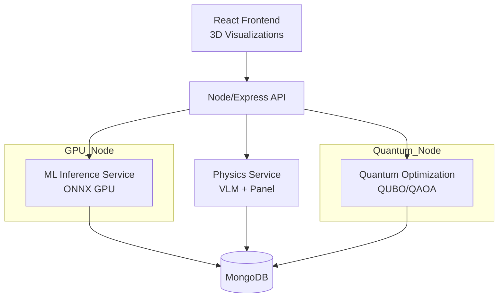

# Quantum-Aero F1 Prototype

A next-generation hybrid **AI + Quantum Computing + GPU Accelerated Aerodynamics** platform designed to optimize aerodynamic performance for **Formula 1** development. This prototype integrates classical CFD physics, surrogate deep-learning models, and quantum optimization workflows into a unified MERN-based application.

## 🚀 Purpose

This project aims to demonstrate how cutting-edge technologies can accelerate aerodynamic design cycles:

* Reduce CFD simulation time with GPU surrogate models.
* Model aerodynamic behavior using Vortex Lattice Methods and Panel Methods.
* Apply Quantum Optimization (QUBO/QAOA) to shape parameters.
* Provide real-time visualization of airflow, pressure, vorticity, and downforce.
* Deliver an engineering-grade app ready for future integration with F1 aerodynamic departments.

---

## 🧠 Core Functionalities

### **1. GPU Surrogate Aerodynamic Modeling**

* Trained on 3D meshes and CFD-generated fields.
* Predicts: pressure coefficient (Cp), downforce, drag components, vorticity.
* Built using **PyTorch CUDA + ONNX Runtime GPU**.

### **2. Classical Physics Engine (VLM + Panel Method)**

* Fast solvers for:

  * Lift/downforce estimation
  * Induced drag
  * Boundary conditions
* Validates ML inferences and assists optimization.

### **3. Quantum Optimization Engine**

* Encodes aerodynamic design variables into **QUBO**.
* Runs **QAOA** via Qiskit Aer simulator.
* Targets multi-objective optimization:

  * Maximize downforce
  * Minimize drag
  * Maintain stability constraints

### **4. MERN Backend + Microservices**

* Express backend orchestrates job execution.
* MongoDB stores meshes, results, runs.
* Microservices for:

  * ML inference
  * Quantum optimization
  * Physics solvers

### **5. React Frontend with 3D Visualization**

* Dark mode landing page.
* Three.js viewer for F1 geometries.
* VTK.js fields: pressure, vorticity, streamlines.
* Real-time optimization dashboard.

---

## 🧩 High-Level Architecture (Mermaid)

---

## 🔧 Technologies

### **Frontend**

* React + Three.js + VTK.js
* TailwindCSS dark mode

### **Backend**

* Node.js + Express + MongoDB
* docker-compose with NVIDIA runtime

### **AI/Physics/Quantum**

* PyTorch CUDA / ONNX Runtime
* Custom VLM + Panel Method solvers
* Qiskit Aer simulator

---

## 🧪 Deployment (Local GPU Laptop)

* Fully runnable on an **NVIDIA RTX GPU laptop**.
* Includes Docker images with:

  * ML GPU service
  * Quantum optimization
  * Physics engine
  * MERN stack backend

---

## 🎯 Target Outcomes

This prototype should:

* Demonstrate feasibility of hybrid AI/quantum aerodynamic optimization.
* Deliver interactive, high-quality visualizations suitable for F1 engineers.
* Showcase a modern, modular architecture ready for team-scale development.

---

## 📈 Future Expansion

* Integration with full RANS/LES CFD datasets.
* Reinforcement learning aerodynamic controllers.
* Real-time telemetry ingestion from wind tunnel or on-track sensors.
* Connecting to cloud-based quantum hardware.

---

## 🏁 Summary

The Quantum-Aero F1 project merges **aerodynamics, AI, and quantum computing** into a single engineering platform. It enables fast iteration, deep visualization, and high-quality optimization—exactly what an F1 aerodynamic group needs for next-generation competitive development.
